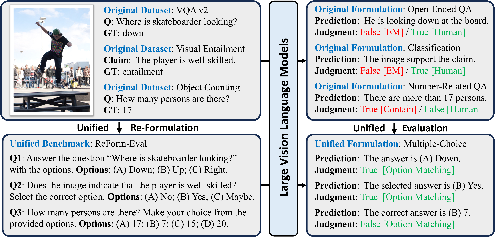

<div align="center">
  <h1 style="display: inline-block; font-size: 48px;">ReForm-Eval</h1>
</div>

<p align="center">

</p>

<p align="center">
    
    
    
    
    <a href="https://hits.seeyoufarm.com"></a>
</p>
<!--  -->

<p align="center">
    <a href="https://arxiv.org/pdf/2310.02569.pdf"></a>
    <a href="https://arxiv.org/abs/2310.02569"></a>
    <a href="https://huggingface.co/datasets/Aweminus/ReForm-Eval-Data/tree/main"></a>
    <a href="https://huggingface.co/datasets/Aweminus/ReForm-Eval-Data/tree/main"></a>
    <!-- <a href="https://huggingface.co/datasets/Aweminus/ReForm-Eval-Data/tree/main">
    <a href="https://huggingface.co/datasets/Aweminus/ReForm-Eval-Data/tree/main"> -->
</p>

<!-- <p align="center">
    <a href="https://huggingface.co/datasets/Aweminus/ReForm-Eval-Data/tree/main"></a>
    <a href="https://huggingface.co/datasets/Aweminus/ReForm-Eval-Data/tree/main"></a>
</p> -->


<div align="center">
  <h2 >ReForm-Eval: EVALUATING LARGE VISION LANGUAGE MODELS VIA UNIFIED RE-FORMULATION OF TASK-ORIENTED BENCHMARKS</h2>
</div>

<!-- <span style='font-size: 24px; font-weight: bold;'><p align='center'>ReForm-Eval: EVALUATING LARGE VISION LANGUAGE MODELS VIA UNIFIED RE-FORMULATION OF TASK-ORIENTED BENCHMARKS</p></span> -->

<p align="center"><strong>Zejun Li<sup>1</sup><sup>†</sup> , Ye Wang<sup>1</sup><sup>†</sup> , Mengfei Du<sup>1</sup><sup>†</sup> , Qingwen Liu<sup>1</sup><sup>†</sup> , Binhao Wu<sup>1</sup><sup>†</sup> , Jiwen Zhang<sup>1</sup><sup>†</sup> , Chengxing Zhou<sup>2</sup> , Zhihao Fan<sup>3</sup> , Jie Fu<sup>4</sup> , Jingjing Chen<sup>1</sup> , Xuanjing Huang<sup>1</sup> , Zhongyu Wei<sup>1</sup><sup>*</sup>.
 </strong></p>
<p align="center"><sup>1</sup>Fudan University      <sup>2</sup>Northeastern University      <sup>3</sup>Alibaba Group        <sup>4</sup>Hong Kong University of Science and Technology</p> 
<p align="center"><sup>†</sup>Equal Contribution        <sup>*</sup>Corresponding Author</p> 

---

<p align="center">
  <a href="https://arxiv.org/abs/2310.02569v1">ReForm-Eval Paper</a> | <a href="https://huggingface.co/datasets/Aweminus/ReForm-Eval/tree/main">🤗ReForm-Eval-Data</a> | <a href="https://huggingface.co/datasets/Aweminus/ReForm-Eval/tree/main">☁️Google Drive</a>
</p>

<!-- <div style="border-left: 2px solid #999; padding-left: 10px; margin-left: 10px; color: #666; font-size: 90%;">
Recent years have witnessed remarkable progress in the development of large vision-language models (LVLMs). Benefiting from the strong language backbones and efficient cross-modal alignment strategies, LVLMs exhibit surprising capabilities to perceive visual signals and perform visually grounded reasoning. However, the capabilities of LVLMs have not been comprehensively and quantitatively evaluated. Most existing multi-modal benchmarks require task-oriented input-output formats, posing great challenges to automatically assess the freeform text output of LVLMs. To effectively leverage the annotations available in existing benchmarks and reduce the manual effort required for constructing new benchmarks, we propose to re-formulate existing benchmarks into unified LVLM compatible formats. Through systematic data collection and reformulation, we present the ReForm-Eval benchmark, offering substantial data for evaluating various capabilities of LVLMs. Based on ReForm-Eval, we conduct extensive experiments, thoroughly analyze the strengths and weaknesses of existing LVLMs, and identify the underlying factors. Our benchmark and evaluation framework will be open-sourced as a cornerstone for advancing the development of LVLMs.
</div> -->

>Recent years have witnessed remarkable progress in the development of large vision-language models (LVLMs). Benefiting from the strong language backbones and efficient cross-modal alignment strategies, LVLMs exhibit surprising capabilities to perceive visual signals and perform visually grounded reasoning. However, the capabilities of LVLMs have not been comprehensively and quantitatively evaluated. Most existing multi-modal benchmarks require task-oriented input-output formats, posing great challenges to automatically assess the freeform text output of LVLMs. To effectively leverage the annotations available in existing benchmarks and reduce the manual effort required for constructing new benchmarks, we propose to re-formulate existing benchmarks into unified LVLM compatible formats. Through systematic data collection and reformulation, we present the ReForm-Eval benchmark, offering substantial data for evaluating various capabilities of LVLMs. Based on ReForm-Eval, we conduct extensive experiments, thoroughly analyze the strengths and weaknesses of existing LVLMs, and identify the underlying factors. Our benchmark and evaluation framework will be open-sourced as a cornerstone for advancing the development of LVLMs.

We explore ways of re-formulating existing benchmarks into unified formats that are compatible with LVLMs. 
<!-- Referring to the following figure, we adapt the evaluation process to the unified form shown in the lower part.  -->

<p align="center"></p>
<!-- Illustration of the unified re-formulation of existing benchmarks into multiple-choice problems. The text within square brackets indicates the evaluation methods, with red and green denoting incorrect and correct judgment, respectively. “EM” is short for exact match. -->
<!-- <h3 align="center"></h3> -->

<span style="font-size:larger;">**Existing LVLMs Evaluation:**</span>

- **No Quantification**: The capabilities of existing LVLMs are mainly demonstrated only by qualitative examples.
- **Task-Oriented**: Most existing multi-modal benchmarks can not be directly utilized to evaluate LVLMs since they are designed for specific tasks and rely on structured input-output formats for evaluation, even need to be fine-tuned or learn task-specific parameters.
- **Limited Samples**: Limited manual annotation such as around 100 samples per dimension in **MME** and **MMBench** could potentially introduce evaluation bias into the results.

<span style="font-size:larger;">**Based on the re-formulation framework, we present our unified multi-modal benchmark, ReForm-Eval:**</span>
- **Larger Data Scale**: ReForm-Eval provides a dataset scale almost **100 times larger** than existing benchmarks, allowing models to be comprehensively evaluated across various dimensions.

- **Without Manual Annotation**: ReForm-Eval leverages publicly open resources, reducing annotation costs while providing a larger-scale dataset.

- **Universal Evaluation**: Unlike **LVLM-ehub** which requires designing complex and dataset-specific evaluation strategies, ReForm-Eval offers greater scalability and a more universally applicable and efficient evaluation approach.

- **Comprehensive Evaluation**: We re-formulate **61 benchmark datasets** based on existing data resources, the evaluation dimensions range from basic visual perception to high-level visual reasoning and dialog.

- **Unified Re-formulation**: Multi-modal benchmark datasets are re-formulated as **multiple-choice problems** or specialized **text generation problems**. Additionally, **generation-based black-box** and **likelihood-based white-box approaches** are implemented for evaluation.

The unified formulation enables universal and comprehensive evaluation. For each formulation, we design a consistent and reliable evaluation method. As mentioned in ([Fu et al., 2023](https://arxiv.org/abs/2306.13394)), current LVLMs may struggle to follow multiple-choice instructions, we propose both black-box and white-box approaches to assist: 

**(1)** Guiding LVLMs to output in desired formats through in-context learning; 

**(2)** Directly calculating the generation probability for options and selecting the one with the highest value. 

Considering the sensitivity of LVLMs to the input prompts ([Zeng et al., 2023](https://arxiv.org/abs/2307.02469)), we additionally design an instability-aware evaluation strategy and introduce a metric to characterize such instability. 

**🔧🔧🔧 ReForm-Eval serves as a reliable tool for quantitative analysis of LVLMs, aiding in the research and development of LVLMs. 🔧🔧🔧**

**🙌🙌🙌 We welcome a diverse range of large vision and language models to participate in ReForm-Eval benchmark evaluation!!! 🙌🙌🙌**

## 📣 Update
**If you have any questions, please send us an email or leave a github issue!**
**`Email: yewang22@m.fudan.edu.cn`**

- **[2023-10]** We released a version of the original paper containing 16 models and 61 reformulated datasets!

## 📖 Contents
- [Model Performance](#🦾-model-performance)
<!-- - [Prepare Dataset](build/prepare_dataset.md#📥-prepare-dataset)
  - [Load Dataset from Hugging Face (Recommended)](build/prepare_dataset.md#load-dataset-from-hugging-face-recommended)
  - [Manually Download](build/prepare_dataset.md#manually-download)
- [Prepare Models](models/prepare_models.md#🤖-prepare-models)
  - [Set Up Existing Models](models/prepare_models.md#set-up-existing-models)
  - [Add Your Own Models](models/prepare_models.md#add-your-own-models)
  - [Preprocessors](models/prepare_models.md#preprocessors) -->
- [Getting Start](#🔥-getting-start)
  - [Install](#install)
  - [Pipeline](#pipeline)
  - [Load Data](#load-data)
  - [Create Your Own Model Interface](#create-your-own-model-interface)
- [Evaluation](#🚀-evaluation)
  - [Demo](#demo)
  - [Parameters](#parameters)
  - [Model Usage](#model-usage)
  <!-- - [Complete Model Usage](models/complete_model_usage.md#complete-model-usage) -->
  - [Data Usage](#data-usage)
  - [Output Result](#output-result)
- [Citation](#🖋-citation)
- [Related Projects](#🔏-related-projects)

## 🦾 Model Performance
We list the average ranking and the score of the model under Generation Evaluation and Likelihood Evaluation in the table below. 

**If you get results on our benchmark using the new LVLM interface, please contact us to add your model to this table.**
**`Email: yewang22@m.fudan.edu.cn`**

| Model          | Gen-Avg-Rank | Gen-Avg-Score | Like-Avg-Rank | Like-Avg     |
|----------------|--------------|---------------|---------------|--------------|
| **BLIP-2**     | *2.3*          | **62.94**         | 4.3           | 62.92        |
| **InstructBLIP_F** | **2.0**      | *60.77*         | 4.0           | 63.48        |
| **InstructBLIP_V** | 4.4      | 52.20         | 3.0           | *64.37*        |
| **LLaVA_V**    | 11.1         | 34.24         | 8.7           | 55.49        |
| **LLaVA_L2**   | 5.9          | 45.78         | 11.2          | 52.97        |
| **MiniGPT4**   | 7.3          | 43.12         | 7.8           | 56.15        |
| **mPLUG-Owl**  | 10.6         | 37.95         | 10.3          | 53.69        |
| **PandaGPT**   | 13.9         | 26.84         | 15.8          | 41.80        |
| **IB-LLM** | 13.0       | 30.24         | 14.5          | 47.58        |
| **LA-V2**      | 12.5         | 32.60         | 12.2          | 50.00        |
| **mmGPT**      | 14.4         | 29.38         | 12.8          | 50.92        |
| **Shikra**     | 11.0         | 36.14         | 7.0           | 58.40        |
| **Lynx**       | 5.0          | 50.00         | *2.8*           | 63.93        |
| **Cheetor_V**  | 6.8          | 44.74         | 8.2           | 56.73        |
| **Cheetor_L2** | 7.9          | 41.75         | 10.7          | 52.43        |
| **BLIVA**      | 7.9          | 42.40         | **2.7**           | **64.92**        |

`Gen-Avg-Rank` and `Like-Avg-Rank` represents the average rank of Generation and Likelihood evaluation. `Gen-Avg-Score` and `Like-Avg-Score` are the average score of Generation and Likelihood evaluation, respectively.

<!-- This table presents the comprehensive performance of each model across dimensions, from which several insights can be gleaned. 
(1) BLIP-2 and InstructBLIP continue to hold the top-2 positions in most dimensions, but in some individual dimensions, Lynx, BLIVA, and Shikra also take the lead. 
(2) It’s worth noting that the effectiveness of models like BLIVA and Lynx only becomes apparent when using likelihood evaluation. We suspect this is attributed to the instruction-following ability of models. 
(3) Compared to models based on CLIP visual encoders, PandaGPT and IB-LLM, which are based on the ImageBind encoder, exhibit relatively poorer performance in image-text tasks. Meanwhile, most top-performing models utilize Vicuna and FlanT5 as the backbone. 
(4) Apart from the architecture, a common characteristic among BLIP-2, InstructBLIP, Lynx, and BLIVA is the use of relatively high-quality data during pre-training.  -->

## 🔥 Getting Start
<!-- **Before performing the evaluation, please refer to [Prepare Dataset](build/prepare_dataset.md#prepare-dataset) and [Prepare Models](models/prepare_models.md#prepare-models).** Our benchmark supports multi-GPU evaluation. If the half evaluation is set, the evaluation can be run on a single machine within CUDA memory of 24G on a single card for 7B models under limited equipment conditions. -->

### Install
**1. Git clone our repository, via the following command**
```bash
git clone https://github.com/FudanDISC/ReForm-Eval.git
cd ReForm-Eval
pip install -r requirements.txt
```

If you want to test all existing 16 models, you need to run the following command
```bash
git clone https://github.com/FudanDISC/ReForm-Eval.git --recursive
cd ReForm-Eval
pip install -r requirements.txt
```

**2. Build from source**
```bash
git clone https://github.com/FudanDISC/ReForm-Eval.git
cd ReForm-Eval
pip install .
```

The advantage of building from source is that you can directly replace the command of `python run_eval.py` and `python run_loader_eval.py` with the `run_eval` or `run_loader_eval` by modifying the config file, and can be executed in any path, including the dataloader function `load_reform_dataset`.

Open your shell configuration file.
```bash
vim ~/.bashrc
```
Add the following line at the end of the file:
```bash
export PYTHONPATH=/path/to/ReForm-Eval:$PYTHONPATH
```

**Note:** Once you use `run_eval` or `run_loader_eval` on other paths, the parameters related to the file dir should be set to absolute paths.

### Pipeline
Our benchmark provides accuracy and instability as metrics for each task, to quantify the model performance. We provide two methods: 

**(A)** Create the interface in our framework and run it directly. 

**(B)** Use the Data Loader we provide and output the inference results, then provide a new script to evaluate with our benchmark, taking the problem formulation and the output json file as input.

#### Method A

**Step 1:** Use an existing model interface or create a new model interface based on ReForm-Eval framework refer to [Create Your Own Model Interface](#create-your-own-model-interface).

**Step 2:** Create the conda env corresponding to the model and install the necessary packages.

**Step 3:** Switch to the corresponding conda env, run `run_eval.py` in the root path of this repository, and add necessary parameters.

```bash
CUDA_VISIBLE_DEVICES=0,1,2,3,4,5,6,7 torchrun --nproc_per_node=8 run_eval.py \
    --model lynx  --model_name models/interfaces/lynx/configs/LYNX.yaml \
    --dataset_name VisDial --output_dir output/lynx/VisDial/test_generation/ \
    --per_gpu_eval_batch_size 4 --formulation SingleChoice \
    --infer_method generation --do_eval --half_evaluation  --dataset_duplication 1 \
    --in_context_sample --option_mark upper \
    --dataset_config build/configs/VisDial_val_v1.2.yaml \
```

**Step 4:** Check the inference progress and results in the terminal. The accuracy, (the format hit rate or instability) can also be viewed in `output_dir/log.txt`.

#### Method B

**Step 1:** Build a dataset using our Data Loader and process them into a string with the desired format of the corresponding model.
<!-- ```python
from build import load_reform_dataset

# example for loading VQA v2
dataset = load_reform_dataset(
    # dataset config, please check Data Usage for available arguments
    dataset_name='VQA',
    formulation='SingleChoice',
    dataset_config='/path/to/ReForm-Eval/build/configs/VQA_vqa_v2_val.yaml',
    inference_method='generation', # inference method, generation / likeligood
    in_context_sample=True, # whether to include in-context-sample
    random_instruct=True, # whether to use different instructions for the same sample
    data_duplication=5, # number of multiple tests for the same sample
    shuffle_options=True, # whether to shuffle the options for the same sample
    load_from_hf:=True, # (Optional) whether to load from huggingface
    offline_from_hf:=False # (Optional) whether to load the huggingface data from the local path
)
``` -->

**Step 2:** The model outputs a json file, such as `/path/to/TDIUC_SingleChoice_likelihood_imagebindLLM_imagebindLLM.json'`, based on the dataset built by **step 1**.

**Step 3:** Run our new script `run_loader_eval.py`, taking the problem formulation and the output json file as main parameters of input.
```python
from run_loader_eval import loader_eval

dataset = loader_eval(formulation='SingleChoice',
            multi_round_eval=False,
            eval_stability=True,
            prediction_file='/path/to/TDIUC_SingleChoice_likelihood_imagebindLLM_imagebindLLM.json'
)
```

Or
```bash
python run_loader_eval.py --formulation SingleChoice --eval_stability \
    --prediction_file test_output/SingleChoice/TDIUC_SingleChoice_likelihood_imagebindLLM_imagebindLLM.json
```

**Note:** There are four types of `Formulation: SingleChoice, Generation, OCROpenEnded and KIEOpenEnded`, respectively. It can only be set `eval_stability` and `multi_round_eval` when `--formulation SingleChoice`, which means that only SingleChoice can measure the instability and be used for the multi-round evaluation.

Notice that each sample in the output json are supposed to be specific format:
```python
{
  # dataset information
  'sample_id': 'VQA_0'
  'answer': 1
  'answer_options': ['yes', 'no', 'maybe']
  'prediction': '(A) yes' # the prediction
}
```

**Note:** During generation-based evaluation for multiple-choice questions, we only consider the format like (A), (a), (1), if a prediction does not hit the format, it will be considered wrong. The requirement for likelihood prediction is `int`, and for generation prediction is `str`.**

**Step 4:** The accuracy, (the format hit rate or instability) can be viewed in `output_dir/log.txt`.

### Load Data
There are two ways to load data, using our framework directly or using Data Loader.

**Note:** The most recommendation is using Hugging Face Data. We introduce how to load Hugging Face data from Hugging Face Hub or the local path. If this still does not work, we also provide other loading methods. Please refer to [Prepare Dataset](build/prepare_dataset.md#📥-prepare-dataset).

Here is the Google Drive URL of our Hugging Face data and you can directly download it!

**download URL:**[https://drive.google.com/file/d/13s4oZWtvSAyTiZing1Pzpi2sFqeYphYx/view?usp=share_link](https://drive.google.com/file/d/13s4oZWtvSAyTiZing1Pzpi2sFqeYphYx/view?usp=share_link)

**wget**
```
wget https://drive.google.com/uc?export=download&id=13s4oZWtvSAyTiZing1Pzpi2sFqeYphYx
```

#### Using ReForm-Eval Framework
If you load data from ReForm-Eval Framework, when running `run_eval.py` and `run_loader_eval.py`, you should set the data-related parameters, including `--dataset_name`, `--formulation`, `--dataset_config`, `--dataset_duplication`, `--in_context_sample` and `--capitalize`.

**Please set `--hf` or `--offline_hf` if you would like to load data from Hugging Face. `--hf` is loading from Hugging Face Hub, and `--offline_hf` is loading Hugging Face data from the local path. If set at the same time, data will be loaded from Hugging Face Hub.**

#### Using Data Loader
ReForm-Eval provides the direct data loader if you would like to perform evaluation without our framework. Here is an example:
```python
from build import load_reform_dataset

# example for loading VQA v2
dataset = load_reform_dataset(
    # dataset config, please check Data Usage for available arguments
    dataset_name='VQA',
    formulation='SingleChoice',
    dataset_config='/path/to/ReForm-Eval/build/configs/VQA_vqa_v2_val.yaml',
    inference_method='generation', # inference method, generation / likeligood
    in_context_sample=True, # whether to include in-context-sample
    random_instruct=True, # whether to use different instructions for the same sample
    data_duplication=5, # number of multiple tests for the same sample
    shuffle_options=True, # whether to shuffle the options for the same sample
    load_from_hf=True, # (Optional) whether to load from huggingface
    option_mark='upper', # (Optional) the option mark to use, number/upper/lower/random
    offline_from_hf=False # (Optional) whether to load the huggingface data from the local path
)
```
Notice that each sample of the loaded dataset will be a dict containing all information like: 
```
{
    'sample_id': 'VQA_000',
    'image': <PIL.JpegImagePlugin.JpegImageFile image mode=RGB size=640x484>,
    'question': 'Is there a cat in the image?',
    'answer': 2,
    'answer_options': ['yes', 'no', 'maybe'],
    'instruct': 'Based on the image, answer the question with the provided options.',
    'question_with_option': 'Is there a cat in the image? Options: (A) yes; (B) no; (C) maybe.'
}
```
You may need to process them into a string with the desired format. You may be intersted in the [Preprocessors](models/prepare_models.md#preprocessors) we used in ReForm-Eval to gather the information into a dialogue-like string as the input for you model. All valid datasets and corresponding arguments are in the [Data Usage](#data-usage).

**Please set `load_from_hf=True` or `offline_from_hf=True` if you would like to load Hugging Face data. `load_from_hf=True` is loading from Hugging Face Hub, and `offline_from_hf=True` is loading Hugging Face data from the local path. If `True` is set at the same time, data will be loaded from Hugging Face Hub.**


### Create Your Own Model Interface
To add new models, you need to create the corresponding model interface for the unified evaluation. For a general new model interface, please refer to the interface template in `/path/to/ReForm-Eval/models/interfaces/base_interface.py`. Here we provide a step-by-step guide for the convenience of your implementation (taking Lynx as an example).

#### Step 1: Configure the Code Path
Add the Lynx project as a submodule to `/path/to/ReForm-Eval/models/interfaces/`:
```bash
cd models/interfaces
git submodule add https://github.com/bytedance/lynx-llm.git
```

#### Step 2: Model Loading
Refer to the code for loading the model in the original Lynx project.
```python
def main(args, config):
    print("### Evaluating", flush=True)
    device = torch.device(args.device)

    seed = args.seed + utils.get_rank()
    torch.manual_seed(seed)
    np.random.seed(seed)
    random.seed(seed)
    cudnn.benchmark = True

    print("config:", json.dumps(config), flush=True)
    print("output_path, ", args.output_path, flush=True)

    print("### Creating model", flush=True)
    from models.lynx import LynxBase
    model = LynxBase(config=config, freeze_vit=config['freeze_vit'], freeze_llm=config['freeze_llm'], load_bridge=False)
```

So, we can implement the `__init__` function for model loading in our interface:
```python
class Lynx_Interface(nn.Module):
    def __init__(self, model_config=None, device=None, half=False, inference_method='generation') -> None:
        super(Lynx_Interface, self).__init__()
        # setup the model device
        if device is None:
            self.device = torch.device("cuda" if torch.cuda.is_available() else "cpu")
        else:
            self.device = torch.device(device)
        
        # loading the model
        self.config = yaml.load(open(model_config, 'r'), Loader=yaml.Loader)
        self.model = LynxBase(config=self.config, freeze_vit=self.config['freeze_vit'], freeze_llm=self.config['freeze_llm'], load_bridge=False)
        
        # locate the model to half-precision and target device if needed
        self.prec_half = half
        if self.prec_half:
            self.model = self.model.half()
        self.model = self.model.to(self.device)
        
        # setup the inference method
        self.inference_method = inference_method
```

#### Step 3: Implement the Inference Function
**Generation-based Black-Box Evaluation**

We provide the Black-box Generation-based Inference Method.
```
Black-box Generation-based Inference Method

Args:
    image (list[PIL.Image]):
        The batch of input images. Each element is loaded as PIL.Image.
    prompt (list[str]):
        The batch of input textual prompts. Prompts should be formulated as a dialoge by the
        model preprocessor (see utils/preprocessors.py)
    temperature (float, **optional**):
        A generation-related parameter: the temperature parameter in the generation process
        of language models.
    max_new_tokens (int, **optional**):
        A generation-related parameter: the maximal number of tokens a model can generate.
        
Returns:
    outputs (list[str]):
        The generated output response in text.

```

An example is provided below:

```python
>>> # An example of VQA for LLaVA
>>> from models.interfaces.llava_interface import LLaVA_Interface
>>> from PIL import Image

>>> image = Image.open(PATH_TO_IMAGE).convert('RGB')
>>> model = LLaVA_Interface(PATH_TO_LLAVA, device='cuda:0')

>>> prompt = "A chat between a curious human and an artificial intelligence assistant. The\
              assistant gives helpful detailed, and polite answers to the human's questions.\
              ###Human: <image>\n Can you see the Image? Options: (A) yes; (B) no.\
              ###Assistant: The answer is (A) yes.\
              ###Human: What color is the truck? Options: (A) blue; (B) orange.\
              ###Assistant: The answer is"

>>> # Generation-based Inference
>>> outputs = model.raw_batch_generate([image], [prompt])
>>> outputs
"(B) orange."
```

Then, find the generation-related code in the original Lynx project.
```python
@torch.no_grad()
def evaluation(model, data_loader, device, config):
    # test
    model.eval()
    result = []

    for n, (idx, vision_input, input_ids, input_atts) in enumerate(data_loader):
        vision_input = vision_input.to(device, non_blocking=True)
        input_ids = input_ids.to(device)
        input_atts = input_atts.to(device)

        text_outputs = model.generate(
            vision_input=vision_input,
            input_ids=input_ids, input_atts=input_atts,
            use_nucleus_sampling=config.get('use_nucleus_sampling', False),
            apply_lemmatizer=config['apply_lemmatizer'],
            num_beams=config['num_beams'],
            min_length=config['min_length'],
            length_penalty=config.get('length_penalty', 1.0),
            no_repeat_ngram_size=config.get('no_repeat_ngram_size', -1),
            top_p=config.get('top_p', 0.9),
            top_k=config.get('top_k', 3),
            max_new_tokens=config.get('max_new_tokens', 64))

        for i, output in zip(idx, text_outputs):
            result.append({"index": i, "text_output": output.strip()})

    return result
```

Therefore, in `lynx_interface.py`, we can implement the generation inference function as:
```python
    @torch.no_grad()
    def raw_generate(self, image, prompt, temperature=1, max_new_tokens=30):
        vision_input = self.load_vision_inp(image).unsqueeze(0)
        if self.prec_half:
            vision_input = vision_input.to(torch.float16)
        
        input_ids, input_atts = self.process_text(prompt)
        
        answer = self.model.generate(
            vision_input=vision_input,
            input_ids=input_ids, input_atts=input_atts,
            use_nucleus_sampling=self.config.get('use_nucleus_sampling', False),
            apply_lemmatizer=self.config['apply_lemmatizer'],
            num_beams=3, # self.config['num_beams'],
            min_length=self.config['min_length'],
            length_penalty=self.config.get('length_penalty', 1.0),
            no_repeat_ngram_size=self.config.get('no_repeat_ngram_size', -1),
            top_p=self.config.get('top_p', 0.9),
            top_k=self.config.get('top_k', 3),
            max_new_tokens=max_new_tokens,
            temperature=temperature)

        return answer[0]
```

In this function, you have to use the internal vision processor to get the vision input (open and get the image), and the internal tokenizer to get the input_ids and input_atts. All of these codes can be directly found and implemented from the original project.
```python
    def load_vision_inp(self, vision_inp):
        if vision_inp is None:
            return None

        elif isinstance(vision_inp, list) or isinstance(vision_inp, np.ndarray):
            return self._get_frames(vision_inp)

        elif isinstance(vision_inp, str):

            if os.path.exists(vision_inp):
                image = Image.open(vision_inp).convert('RGB')

            else:  # base64 encoding
                try:
                    image = Image.open(io.BytesIO(b64decode(vision_inp))).convert("RGB")
                except Exception as e:
                    raise ValueError(f"check whether it is a rpath (and not exist)?: {vision_inp} {e}")
        else:
            image = vision_inp
        
        image = self.img_transform(image)

        return image.to(self.device)
    
    def process_text(self, text):
        text = text.strip()
        if self.lower_text:
            text = text.lower()
        input_ids = [self.tokenizer.bos_token] + self.tokenizer.tokenize(text)
        # print(input_ids)
        input_ids = self.tokenizer.convert_tokens_to_ids(input_ids)
        input_atts = torch.LongTensor([[1]*len(input_ids)])
        input_ids = torch.LongTensor([input_ids])
        return input_ids.to(self.device), input_atts.to(self.device)
```

**Likelihood-based White-Box Evaluation**

We provide the White-box Likelihood-based Inference Method.
```
White-box Likelihood-based Inference Method

Args:
    image (list[PIL.Image]):
        The batch of input images. Each element is loaded as PIL.Image.
    prompt (list[str]):
        The batch of input textual prompts. Prompts should be formulated as a dialoge by the
        model preprocessor (see utils/preprocessors.py)
    candidates (list[list[str]]):
        The list of candidate lists, each element (candidates[i]) is the candidate list
        of the corresponding question.
        
Returns:
    outputs (list[int]):
        The generated output prediction index. Each element (outputs[i]) is the selected index
        of the corresponding candidates. The prediction is therefore (candidates[i][outputs[i]])
```

Here is an example:
```python
>>> # An example of VQA for LLaVA
>>> from models.interfaces.llava_interface import LLaVA_Interface
>>> from PIL import Image

>>> image = Image.open(PATH_TO_IMAGE).convert('RGB')
>>> model = LLaVA_Interface(PATH_TO_LLAVA, device='cuda:0')

>>> prompt = "A chat between a curious human and an artificial intelligence assistant. The\
              assistant gives helpful detailed, and polite answers to the human's questions.\
              ###Human: What color is the truck?\
              ###Assistant:"
>>> candidates = ['orange', 'blue']

>>> # Likelihood-based Inference
>>> outputs = model.raw_batch_predict([image], [prompt], [candidates])
>>> outputs
1
```

To support the likelihood evaluation, we add the following function in our model file `/path/to/ReForm-Eval/models/interfaces/lynx/models/lynx.py` to calculate the loss (neg-log likelihood) for each sequence.
```python
    def forward_likelihood(self, vision_input, input_ids, input_atts, labels, likelihood_reduction='sum'):
        text_embeds = self.embed_tokens(input_ids)

        if vision_input is not None:
            vision_embeds, vision_atts = self.get_vision_embeds(vision_input)
            v2t_feats, v2t_atts = self.bridge(vision_embeds=vision_embeds, vision_atts=vision_atts)

            inputs_embeds = torch.cat([v2t_feats, text_embeds], dim=1)
            attention_mask = torch.cat([v2t_atts, input_atts], dim=1)

        else:
            inputs_embeds = text_embeds
            attention_mask = input_atts

        outputs = self.LLM(
            inputs_embeds=inputs_embeds,
            attention_mask=attention_mask,
            labels=labels,
            return_dict=True,
            reduction='none'
        )
        loss = outputs.loss.reshape(inputs_embeds.shape[0], -1)
        if likelihood_reduction == 'sum':
            loss = loss.sum(1)
        elif likelihood_reduction == 'mean':
            valid_num_targets = (loss > 0).sum(1)
            loss = loss.sum(1) / valid_num_targets
        elif likelihood_reduction == 'none':
            loss = loss
        else:
            raise ValueError
        return loss
```

Hence, in `lynx_interface.py`, we can use `self.model.forward_likelihood` at the `raw_predict` function.
```python
    def raw_predict(self, image, prompt, candidates, likelihood_reduction='sum'):
        # loading the image-text pair
        vision_input = self.load_vision_inp(image).unsqueeze(0)
        if self.prec_half:
            vision_input = vision_input.to(torch.float16)
        
        input_ids, attention_mask = self.process_text(prompt)
        
        # get the embedding from the input
        num_cand = len(candidates)
        input_seq_len = input_ids.shape[1]

        # tokenize the candidates
        current_padding_side = self.tokenizer.padding_side
        current_truncation_side = self.tokenizer.truncation_side
        self.tokenizer.padding_side = 'right'
        self.tokenizer.truncation_side = 'right'
        if self.lower_text:
            candidates = [cand.lower() for cand in candidates]
        candidates_tokens = self.tokenizer(
            candidates,
            return_tensors='pt',
            padding='longest'
        ).to(self.device)
        self.tokenizer.padding_side = current_padding_side
        self.tokenizer.truncation_side = current_truncation_side

        # construct the inputs_ids and LM targets
        candidates_ids = candidates_tokens.input_ids[:, 1:] # remove the <s> token
        candidates_att = candidates_tokens.attention_mask[:, 1:] # remove the <s> token
        # mask the LM targets with <pad>
        cand_targets = candidates_ids.clone()
        cand_targets = cand_targets.masked_fill(cand_targets == self.tokenizer.pad_token_id, -100)
        # mask the targets for inputs part
        targets = torch.cat([-100*torch.ones(num_cand, input_seq_len+self.config["num_bridge_tokens"], dtype=torch.long, device=self.device), \
                             cand_targets], dim=1)
        # concatenate the inputs for the model
        attention_mask = torch.cat([attention_mask.repeat_interleave(num_cand, dim=0), candidates_att], dim=1)
        full_input_ids = torch.cat([input_ids.repeat_interleave(num_cand, dim=0), candidates_ids], dim=1)
        
        # calculate the loss (neg-log likelihood) for each candidate
        with torch.inference_mode():
            outputs = self.model.forward_likelihood(
                vision_input=vision_input.repeat_interleave(num_cand, dim=0),
                input_ids=full_input_ids,
                input_atts=attention_mask,
                labels=targets,
                likelihood_reduction=likelihood_reduction
            )
        neg_likelihood = outputs
        # select the one with the highest likelihood / lowest loss
        output_class_ranks = torch.argsort(neg_likelihood, dim=-1)[0].item()

        return output_class_ranks
```

#### Step 4: Implement the Preprocessor
Preprocessors are used to formulate the structural information in order to get the correct form of dialogue. Our preprocessor is in `/path/to/ReForm-Eval/utils/preprocessors.py`.
```python
class ConvSingleChoiceProcessor(object):
    def __init__(self, sep, sep2=None, roles=['Question', 'Answer'], system_msg=None, first_query_fn=None, \
                 init_conv=None, sep_style='two', alphabet_choice=None, infer_method='generation', response_prefix=None):
        """
        Preprocessors to convert input information into a dialogue string
        
        Args:
            sep (str):
                The text separator-1.
            sep2 (str):
                The text separator-2.
            roles (list[str]):
                Role names of the dialogue, roles[0] is the role of users while 
                roles[1] is the name of assistants.
            system_msg (str, **optional**):
                The system message that appears at the beginning.
            first_query_fn (function, **optional**):
                The function to process the first query, mainly for adding  marks.
            init_conv (list[list[str]]):
                The initial conversation. Each element is a list[str, str] where the first
                is the role name and the second is the message. 
            sep_style (str):
                The dialogue style. 
            alphabet_choice (str, **optional**):
                The option mark used for multiple-choice questions, defaults to "random"
            infer_method (str, "optional"):
                The inference method ("generation" or "likelihood")
            response_prefix (str, **optional**):
                The prefix text for the response of LVLM assistants, we use "The answer is"
                to help with multiple-choice questions.
                
        Returns:
            output (str):
                The constructed dialogue text.
        """
```

Here is an example of the `\n`-separated preprocessor:
```python
proc = ConvSingleChoiceProcessor('\n', roles=['User', 'Bot'], first_query_fn=lambda x: "<image> "+x,
                                sep_style='one', infer_method=model_args['inference_method'], response_prefix='The answer is',
                                system_message="A chat between a curious human and an artificial intelligence assistant. The 
                                assistant gives helpful, detailed, and polite answers to the human's questions.")
```

The input sample is a json-style dict:
```
inputs = {'sample_id': '287626_3',
 'round_id': 3,
 'image': 'IMAGE_PATH.jpg',
 'question': 'Is there a cat in the image?',
 'answer': '2',
 'answer_options': ['yes', 'no', 'maybe'],
 'history': [{'from': 'human', 'value': 'Can you see the image? Options: (A) yes; (B) no'},
             {'from': 'assistant', 'value': 'The answer is (A) yes'}]
}
```

Therefore, the final content will be:
```
A chat between a curious human and an artificial intelligence assistant. The assistant gives helpful, detailed, and polite answers to the human's questions.
User: <image> Can you see the image? Options: (A) yes; (B) no.\n
Bot: The answer is (A) yes\n
User: Is there a cat in the image? Options: (A) yes; (B) no; (C) maybe.\n
Bot:The answer is
```

For other supported sep_style, please refer to `/path/to/ReForm-Eval/utils/preprocessors.py`.
`init_conv` can also be used to add `<image>` marks, if it is `init_conv=[['User', "<image>"]]`, this means that a new conversation will be started.

```
User: <image>
User: ......
Bot: ......
```

#### Step 5: Add Model Loader
Implement the model loading function in `/path/to/ReForm-Eval/models/interfaces/lynx_interface.py`.
```python
def get_lynx(model_config=None):
    model_args = {}
    # map the general input arguments to the model-specific arguments
    if model_config is not None:
        valid_args = ['model_name', 'device', 'half', 'inference_method']
        target_args = ['model_config', 'device', 'half', 'inference_method']
        for i, arg in enumerate(valid_args):
            if arg in model_config:
                model_args[target_args[i]] = model_config[arg]
    # configure the dialogue preprocessor
    proc = ConvSingleChoiceProcessor('\n', roles=['User', 'Bot'], \
                                     sep_style='one', infer_method=model_args['inference_method'], response_prefix='The answer is')
    return Lynx_Interface(**model_args), proc
```

Additionally, you should add the following codes in  `/path/to/ReForm-Eval/models/__init__.py`.
```python
    elif model_name == 'lynx':
        from .interfaces.lynx_interface import get_lynx
        return get_lynx(model_config)
```

#### Done!
Finally, you can use the following model arguments in the main entrance to evaluate your model! 
```bash
--model lynx  --model_name models/interfaces/lynx/configs/LYNX.yaml
```

If you have trouble incorporating new models into our framework, please let us know through GitHub issues or emails. For more details about models and preprocessors, please refer to [Prepare Models](models/prepare_models.md#🤖-prepare-models).

## 🚀 Evaluation
Our benchmark supports multi-GPU evaluation. If the half evaluation is set, the evaluation can be run on a single machine within CUDA memory of 24G on a single card for 7B models under limited equipment conditions.

### Demo
We provide one example of running the benchmark test, using Lynx model for VisDial Evaluation.
```bash
CUDA_VISIBLE_DEVICES=0,1,2,3,4,5,6,7 torchrun --nproc_per_node=8 run_eval.py \
    --model lynx  --model_name models/interfaces/lynx/configs/LYNX.yaml \
    --dataset_name VisDial --output_dir output/lynx/VisDial/test_generation/ \
    --per_gpu_eval_batch_size 4 --formulation SingleChoice \
    --infer_method generation --do_eval --half_evaluation  --dataset_duplication 1 \
    --in_context_sample --option_mark upper \
    --dataset_config build/configs/VisDial_val_v1.2.yaml \
```

The num of `--nproc_per_node` must be equal to the num of `CUDA_VISIBLE_DEVICES`. 
`--output_dir` is the path of output result. 
`--formulation` must be `Generation`, `SingleChoice`, `OCROpenEnded` or `KIEOpenEnded`. 
`--infer_method` must be `generation` or `likelihood`. 
If you infer in generation mode, you should use `--in_context_sample` to assist models to generate option marks for most questions. 
`--dataset_config` is the path of the dataset config file.

### Parameters
All parameters used are listed below and you can modify any parameter to customize your evaluation settings.

```python
def main():
    parser = argparse.ArgumentParser()
    # model-related parameters
    parser.add_argument('--model', type=str, default=None, help='the model family name')
    parser.add_argument('--model_name', type=str, default=None, help='the model name to load')
    parser.add_argument('--model_type', type=str, default=None, help='the model type to set')
    # dataset-related parameters
    parser.add_argument('--dataset_name', type=str, default=None, help='the dataset name to evaluate on')
    parser.add_argument('--formulation', type=str, default=None, help='the problem formulation to perform, must be in ("Generation", "SingleChoice")')
    parser.add_argument('--dataset_config', type=str, default=None, help='the config file path, using the default path without explicit ')
    parser.add_argument('--dataset_duplication', type=int, default=1, help='duplicate the sample for evaluating the stability')
    parser.add_argument('--in_context_sample', action='store_true', help='whether to provide in-context-learning samples')
    parser.add_argument('--capitalize', action='store_true', help='whether to capitalize the qa')
    # 0805 add
    parser.add_argument('--yesno_instruct', action='store_true', help='whether add "please answer yes or no" to the full instruct')
    parser.add_argument('--answer_space_instruct', action='store_true', help='whether add answer space to the full instruct')
    # running parameters
    parser.add_argument('--per_gpu_eval_batch_size', type=int, default=1, help='the batch size per GPU')
    parser.add_argument('--num_workers', type=int, default=4, help='workers in dataloader')
    parser.add_argument('--half_evaluation', action='store_true', help='whether to use half precision for evluation')
    # general evaluation setup
    parser.add_argument('--do_eval', action='store_true', help='whether to evluate the output.')
    parser.add_argument('--eval_stability', action='store_true', help='whether to evaluate the stability')
    # parameters for model generation
    parser.add_argument('--temperature', type=float, default=None, help='the temperature for generation')
    parser.add_argument('--max_new_tokens', type=int, default=None, help='max new tokens to generate')
    # parameters for likelihood measurement
    parser.add_argument('--likelihood_reduction', type=str, default=None, help='the reduction method for likelihood measurement')
    # parameters for SingleChoice problem
    parser.add_argument('--infer_method', type=str, default='generation', help='the inference method to use, must be in ["generation", "likelihood"]')
    parser.add_argument('--option_mark', type=str, default=None, help='the index mark for options in single-shoice questions, \
                        "number" for (1,2,3,4), "lower" for (a,b,c,d) while "upper" for (A,B,C,D)')
    # parameters for randomness control
    parser.add_argument('--random_instruct', action='store_true', help='whether to use random instructions')
    parser.add_argument('--shuffle_options', action='store_true', help='whether to shuffle options')
    # parameters for multi-round problem
    parser.add_argument('--options_in_history', action='store_true', help='whether to put options in history.')
    parser.add_argument('--online_multi_round', action='store_true', help='make online update to the history during dialog')
    parser.add_argument('--multi_round_eval', action='store_true', help='whether to evaluate multi-round performance')
    # output setup
    parser.add_argument('--output_dir', type=str, default='./output/', help='the path to save the output')
    # debug mode
    parser.add_argument('--dataset_debug', action='store_true', help='debug on the dataset setup')
    parser.add_argument('--dataset_subsample', type=int, default=None, help='only n sub-samples of the dataset')
    # core
    parser.add_argument('--core_eval', action='store_true', help='only eval on the core datasets')
    # hugging face
    parser.add_argument('--hf', action='store_true', help='whether to load the dataset directly from Hugging Face')
    parser.add_argument('--offline_hf', action='store_true', help='whether to load the Hugging Face data from the local path')
    args = parser.parse_args()
```

### Model Usage
When running the evaluation, these model-related parameters must be applied for specific models.

**Some models require additional forward_likelihood function, please refer to `Likelihood-based White-Box Evaluation` in [Create Your Own Model Interface](#create-your-own-model-interface).**

We only list a few examples of BLIP-2 and InstructBLIP here. For the remaining models, please refer to the [Complete Model Usage](models/complete_model_usage.md#complete-model-usage).

#### BLIP-2 + InstructBLIP
```bash
# BLIP-2 flant5
--model blip2  --model_name blip2_t5  --model_type pretrain_flant5xl
# InstructBLIP flan-t5
--model blip2  --model_name blip2_t5_instruct  --model_type flant5xl
# InstructBLIP vicuna
--model blip2  --model_name blip2_vicuna_instruct  --model_type vicuna7b
```
You also have to put `bert-base-uncased` and `google/flan-t5-xl` folders on the root directory of our repository.
```
|-- ReForm-Eval
    |-- bert-base-uncased
    |-- google
        |-- flan-t5-xl
        ...
    |-- build
    |-- commands
    |-- metrics
    |-- models
    ...
```

If you load `blip2_t5`, you need to add the `predict_class` function in `blip2_t5.py`.
```python
    def predict_class(
        self,
        samples,
        candidates,
        n_segments=1,
    ):
        # If candidates is a list of lists, each sample has its candidates, then we need to iterate one by one
        if type(candidates[0]) == list:
            results = []

            for i in range(samples["image"].size(0)):
                # add support for different prompts for different samples
                this_sample = {
                    "image": samples["image"][i].unsqueeze(0),
                    "prompt": samples["prompt"][i] if type(samples["prompt"]) == list else samples['prompt'],
                }

                if "text_input" in samples.keys():
                    this_sample["text_input"] = [samples["text_input"][i]]

                if 'context' in samples.keys():
                    this_sample['context'] = [samples["context"][i]]

                if 'history' in samples.keys():
                    this_sample['history'] = [samples["history"][i]]

                if 'caption' in samples.keys():
                    this_sample['caption'] = [samples["caption"][i]]

                this_result = self._predict_class(this_sample, candidates[i], n_segments)
                results.append(this_result)

            try:
                results = torch.cat(results, dim=0)
            except:
                results = [res.tolist()[0] for res in results]

            return results

        return self._predict_class(samples, candidates, n_segments)

    def _predict_class(
        self,
        samples,
        candidates,
        n_segments=1,
    ):
        """
        Args:
            samples (dict): A dictionary containing the following keys:
                - image (torch.Tensor): A tensor of shape (batch_size, 3, H, W)
                - prompt: the instruction
            candidates:
                (list): A list of candidate class names;
            n_segments:
                (int): Split the candidates into n_segments and predict one by one. This is useful when the number of candidates is too large.
        Returns:
            output_class: predicted class index
        """

        image = samples["image"]
        prompt = samples["prompt"]

        bs = image.size(0)

        if isinstance(prompt, str):
            prompt = [prompt] * bs
        else:
            assert len(prompt) == bs, "The number of prompts must be equal to the batch size."

        if "text_input" in samples.keys():
            if type(samples["text_input"][0]) == list:
                prompt = [prompt[i].format(*samples["text_input"][i]) for i in range(len(prompt))]
            else:
                prompt = [prompt[i].format(samples["text_input"][i]) for i in range(len(prompt))]

        # scienceqa
        if 'context' in samples.keys() and samples['context'] != '':
            prompt = [f'context: {samples["context"][i]}. {prompt[i]}' for i in range(len(prompt))]

        # visual dialog
        if 'history' in samples.keys() and samples['history'][0] != '':
            prompt = [f'dialog history: {samples["history"][i]}\n{prompt[i]}' for i in range(len(prompt))]

        if 'caption' in samples.keys() and samples['caption'][0] != '':
            prompt = [f'This image has the caption "{samples["caption"][i]}". {prompt[i]}' for i in range(len(prompt))]

        query_tokens = self.query_tokens.expand(bs, -1, -1)
 
        if image.dim() == 5:
            inputs_t5, atts_t5 = [], []
            for j in range(image.size(2)):
                this_frame = image[:,:,j,:,:]
                with self.maybe_autocast():
                    frame_embeds = self.ln_vision(self.visual_encoder(this_frame))
                    frame_atts = torch.ones(frame_embeds.size()[:-1], dtype=torch.long).to(image.device)

                frame_query_output = self.Qformer.bert(
                    query_embeds=query_tokens,
                    encoder_hidden_states=frame_embeds,
                    encoder_attention_mask=frame_atts,
                    return_dict=True,
                )

                frame_inputs_t5 = self.t5_proj(frame_query_output.last_hidden_state[:,:query_tokens.size(1),:])
                frame_atts_t5 = torch.ones(frame_inputs_t5.size()[:-1], dtype=torch.long).to(image.device)
                inputs_t5.append(frame_inputs_t5)
                atts_t5.append(frame_atts_t5)
            inputs_t5 = torch.cat(inputs_t5, dim=1)
            atts_t5 = torch.cat(atts_t5, dim=1)
        else:
            with self.maybe_autocast():
                image_embeds = self.ln_vision(self.visual_encoder(image))
            image_atts = torch.ones(image_embeds.size()[:-1], dtype=torch.long).to(image.device)

            query_output = self.Qformer.bert(
                query_embeds=query_tokens,
                encoder_hidden_states=image_embeds,
                encoder_attention_mask=image_atts,
                return_dict=True,
            )

            inputs_t5 = self.t5_proj(query_output.last_hidden_state[:,:query_tokens.size(1),:])
            atts_t5 = torch.ones(inputs_t5.size()[:-1], dtype=torch.long).to(image.device)

        input_tokens = self.t5_tokenizer(
            prompt, padding="longest", return_tensors="pt"
        ).to(image.device)
        output_tokens = self.t5_tokenizer(
            candidates, padding="longest", return_tensors="pt"
        ).to(image.device)

        encoder_atts = torch.cat([atts_t5, input_tokens.attention_mask], dim=1)

        n_cands = len(candidates)

        with self.maybe_autocast(dtype=torch.bfloat16):
            inputs_embeds = self.t5_model.encoder.embed_tokens(input_tokens.input_ids)
            inputs_embeds = torch.cat([inputs_t5, inputs_embeds], dim=1)

            encoder_outputs = self.t5_model.encoder(
                inputs_embeds=inputs_embeds,
                attention_mask=encoder_atts,
            )

            all_losses = []
            for n in range(n_segments):
                seg_len = n_cands // n_segments
                if n == (n_segments - 1):
                    seg_len = n_cands - seg_len * (n_segments - 1)

                # this_encoder_outputs = copy.deepcopy(encoder_outputs)
                this_encoder_outputs = BaseModelOutput(
                    last_hidden_state=encoder_outputs[0].clone(),
                )

                this_encoder_outputs['last_hidden_state'] = this_encoder_outputs[0].repeat_interleave(seg_len, dim=0)
                this_encoder_atts = encoder_atts.repeat_interleave(seg_len, dim=0)

                start_i = n * (n_cands // n_segments)
                end_i = start_i + seg_len
                this_output_tokens_ids = output_tokens.input_ids[start_i:end_i].repeat(bs, 1)
                this_output_tokens_atts = output_tokens.attention_mask[start_i:end_i].repeat(bs, 1)

                this_targets = this_output_tokens_ids.masked_fill(this_output_tokens_ids == self.t5_tokenizer.pad_token_id, -100)

                outputs = self.t5_model(
                    encoder_outputs=this_encoder_outputs,
                    attention_mask=this_encoder_atts,
                    decoder_attention_mask=this_output_tokens_atts,
                    return_dict=True,
                    labels=this_targets,
                    reduction="none",
                )
                loss = outputs.loss

                loss = loss.reshape(bs, seg_len)
                # output_class_ranks = torch.argsort(loss, dim=-1)
                all_losses.append(loss)

            all_losses = torch.cat(all_losses, dim=-1)
            output_class_ranks = torch.argsort(all_losses, dim=-1)

        return output_class_ranks
```

Then, you should run the following command to implement the modification.
```
cd models/LAVIS
pip install e .
```


### Data Usage
For data-related parameters, we list required parameters of different tasks for comprehensive evaluation.

#### Coarse-Grained Perception
Coarse-grained perception (CG) is the ability to recognize the overall layout and main objects at the image level.

##### Flowers102
```bash
--dataset_name Flowers102 --formulation SingleChoice --dataset_config build/configs/ImageClassification_flowers102_val.yaml
```
##### CIFAR10
```bash
--dataset_name CIFAR10 --formulation SingleChoice --dataset_config build/configs/ImageClassification_cifar10_val.yaml
```
##### ImageNet-1K
```bash
--dataset_name ImageNet-1K --formulation SingleChoice --dataset_config build/configs/ImageClassification_imagenet1k_val.yaml
```
##### Pets37
```bash
--dataset_name Pets37 --formulation SingleChoice --dataset_config build/configs/ImageClassification_pets37_val.yaml
```
##### VizWiz-yesno
```bash
--dataset_name VizWiz --formulation SingleChoice --dataset_config build/configs/ImageQuality_vizwiz_yesNo_val.yaml
```
##### VizWiz-singleChoice
```bash
--dataset_name VizWiz --formulation SingleChoice --dataset_config build/configs/ImageQuality_vizwiz_singleChoice_val.yaml
```
##### TDIUC-Sport
```bash
--dataset_name VizWiz --formulation SingleChoice --dataset_config build/configs/ImageQuality_vizwiz_singleChoice_val.yaml
```
##### TDIUC-Scene
```bash
--dataset_name TDIUC --formulation SingleChoice --dataset_config build/configs/TDIUC_scene.yaml
```
##### MEDIC
```bash
--dataset_name MEDIC --formulation SingleChoice --dataset_config build/configs/DisasterType_val.yaml
```

#### Fine-Grained Perception
Fine-grained perception (FG) requires detailed sensing at the object level.

##### MSCOCO-MCI
```bash
--dataset_name MSCOCO --formulation SingleChoice --dataset_config build/configs/MulticlassIdentification_val.yaml
```
##### MSCOCO-GOI
```bash
--dataset_name MSCOCO --formulation SingleChoice --dataset_config build/configs/GroundedObjIdentification_val.yaml
```
##### MSCOCO-MOS
```bash
--dataset_name MSCOCO --formulation SingleChoice --dataset_config build/configs/MissingObjectSelection_val.yaml
```

##### TDIUC-Color
```bash
--dataset_name TDIUC --formulation SingleChoice --dataset_config build/configs/TDIUC_color.yaml
```
##### TDIUC-Utility
```bash
--dataset_name TDIUC --formulation SingleChoice --dataset_config build/configs/TDIUC_utility.yaml
```
##### TDIUC-Position
```bash
--dataset_name TDIUC --formulation SingleChoice --dataset_config build/configs/TDIUC_position.yaml
```
##### TDIUC-Detection
```bash
--dataset_name TDIUC --formulation SingleChoice --dataset_config build/configs/TDIUC_detection.yaml
```
##### TDIUC-Counting
```bash
--dataset_name TDIUC --formulation SingleChoice --dataset_config build/configs/TDIUC_counting.yaml
```
##### RefCOCO
```bash
--dataset_name RefCOCO --formulation SingleChoice --dataset_config build/configs/ReferringExpression_val.yaml
```
##### MSCOCO-OC
```bash
--dataset_name MSCOCO --formulation SingleChoice --dataset_config build/configs/ObjectCounting_mscoco_val.yaml
```

#### Visually Grounded Reasoning
A reliable LVLM is supposed to perform reasoning based on multi-modal contextual information. In order to assess such capability, we adopt the commonly applied visual question answering (VQA) task and its variant, knowledge-based visual question answer (K-VQA), which further requires models to utilize internally stored knowledge.

##### VQA v2
``` bash
--dataset_name VQA --formulation SingleChoice --dataset_config build/configs/VQA_vqa_v2_val.yaml
```

##### GQA
``` bash
--dataset_name VQA --formulation SingleChoice --dataset_config build/configs/VQA_gqa_val_v2.0.yaml
```

##### Whoops
``` bash
--dataset_name VQA --formulation SingleChoice --dataset_config build/configs/VQA_whoops_val.yaml
```
##### OK-VQA
``` bash
--dataset_name VQA --formulation SingleChoice --dataset_config build/configs/VQA_okvqa_val.yaml
```

##### ScienceQA
``` bash
--dataset_name VQA --formulation SingleChoice --dataset_config build/configs/VQA_scienceqa_val_v2.0.yaml
```

##### VizWiz
``` bash
--dataset_name VQA --formulation SingleChoice --dataset_config build/configs/VQA_vizwiz_val_v2.0.yaml
```


##### ViQuAE
``` bash
--dataset_name VQA --formulation SingleChoice --dataset_config build/configs/VQA_viquae_val.yaml
```

##### K-ViQuAE
``` bash
--dataset_name KVQA --formulation SingleChoice --dataset_config build/configs/KVQA_viquae_val.yaml
```

##### A-OKVQA
``` bash
--dataset_name VQA --formulation SingleChoice --dataset_config build/configs/VQA_aokvqa_val.yaml
```

##### A-OKVQRA
``` bash
--dataset_name VQRA --formulation SingleChoice --dataset_config build/configs/VQRA_aokvqa_val.yaml
```

##### A-OKVQAR
``` bash
--dataset_name VQAR --formulation SingleChoice --dataset_config build/configs/VQAR_aokvqa_val.yaml
```

##### ImageNetVC
``` bash
--dataset_name VQA --formulation SingleChoice --dataset_config build/configs/VQA_imagenetvc_val.yaml
```

#### Spatial Understanding
Spatial understanding is the key to the real-life application of LVLMs on robots. This task requires a comprehensive understanding of both the object-object and object-observer relationship so as to make reasonable behaviors.

##### CLEVR
``` bash
--dataset_name CLEVR --formulation SingleChoice --dataset_config build/configs/Spatial_clevr_val.yaml
```

##### VSR
``` bash
--dataset_name VSR --formulation SingleChoice --dataset_config build/configs/Spatial_vsr_val.yaml
```

##### MP3D
``` bash
--dataset_name MP3D --formulation SingleChoice --dataset_config build/configs/Spatial_mp3d_val.yaml
```


#### Multi-Turn Dialogue
ReForm-Eval evaluates the performance of LVLMs in multi-turn dialogues.

##### VQA-MT
``` bash
--dataset_name VisDial --formulation SingleChoice --dataset_config build/configs/VQA_vqa_MultiRound_val.yaml --online_multi_round --num_workers 0
```

##### VisDial
``` bash
--dataset_name VisDial --formulation SingleChoice --dataset_config build/configs/VisDial_val_v1.2.yaml --online_multi_round --num_workers 0
```

Please refer to [Online Multi-round Dialogue](build/prepare_dataset.md#online-multi-round-dialogue) for the details of the setup of online multi-round dialogues.

#### Cross-Modal Inference
We consider two tasks: image-text matching (ITM) requires models to measure the cross-modal similarities and visual entailment (VE) demands models to check whether the information is entailed across modalities.

##### MSCOCO-ITM
```bash
--dataset_name MSCOCO --formulation SingleChoice --dataset_config build/configs/ImageTextMatching_val.yaml
```
##### MSCOCO-ITS
```bash
--dataset_name MSCOCO --formulation SingleChoice --dataset_config build/configs/ImageTextSelection_val.yaml
```

##### WikiHow
```bash
--dataset_name WikiHow --formulation SingleChoice --dataset_config build/configs/TemporalOrdering_val.yaml
```

##### Winoground
``` bash
--dataset_name CaptionSelection --formulation SingleChoice --dataset_config build/configs/CaptionSelection_winoground_val.yaml
```

##### SNLI-VE
```bash
--dataset_name SNLI-VE --formulation SingleChoice --dataset_config build/configs/VisualEntailment_val.yaml
```

##### MOCHEG
``` bash
--dataset_name MCV  --formulation SingleChoice --dataset_config build/configs/MCV_mocheg_val.yaml
```

#### Scene Text Perception
Scene text perception enables LVLMs to identify, understand, and perform inference based on text in images.

##### Grounded IC15
```bash
--dataset_name IC15 --formulation OCROpenEnded --dataset_config build/configs/GroundOCR_ic15_val.yaml
```

##### IC15
```bash
--dataset_name IC15 --formulation OCROpenEnded --dataset_config build/configs/OCR_ic15_val.yaml
```

##### Grounded COCO-Text
```bash
--dataset_name COCO_text --formulation OCROpenEnded --dataset_config build/configs/GroundOCR_cocotext_val.yaml
```

##### COCO-Text
```bash
--dataset_name COCO_text --formulation OCROpenEnded --dataset_config build/configs/OCR_cocotext_val.yaml
```

##### Grounded TextOCR
```bash
--dataset_name TextOCR --formulation OCROpenEnded --dataset_config build/configs/GroundOCR_textocr_val.yaml
```

##### TextOCR
```bash
--dataset_name TextOCR --formulation OCROpenEnded --dataset_config build/configs/OCR_textocr_val.yaml
```

##### CUTE80
```bash
--dataset_name CUTE80 --formulation OCROpenEnded --dataset_config build/configs/OCR_cute80_val.yaml
```

##### IIIT5K
```bash
--dataset_name IIIT5K --formulation OCROpenEnded --dataset_config build/configs/OCR_iiit5k_val.yaml
```

##### WordArt
```bash
--dataset_name WordArt --formulation OCROpenEnded --dataset_config build/configs/OCR_wordart_val.yaml
```

##### FUNSD
```bash
--dataset_name FUNSD --formulation KIEOpenEnded --dataset_config build/configs/KIE_funsd_val.yaml
```

##### POIE
```bash
--dataset_name POIE --formulation OCROpenEnded --dataset_config build/configs/KIE_poie_val.yaml
```

##### SROIE
```bash
--dataset_name SROIE --formulation OCROpenEnded --dataset_config build/configs/KIE_sroie_val.yaml
```

##### TextVQA
``` bash
--dataset_name OCR --formulation OCROpenEnded --dataset_config build/configs/OCR_textvqa_val.yaml
```

##### DocVQA
``` bash
--dataset_name OCR --formulation OCROpenEnded --dataset_config build/configs/OCR_docvqa_val.yaml
```

##### OCR-VQA
``` bash
--dataset_name OCR --formulation OCROpenEnded --dataset_config build/configs/OCR_ocrvqa_val.yaml
```

#### Visual Description
Visual description is an inherent capability of LVLMs as generative models.

##### MSCOCO
```bash
--dataset_name MSCOCO --formulation Generation --dataset_config build/configs/Caption_MSCOCO_val.yaml
```

##### TextCaps
```bash
--dataset_name TextCaps --formulation Generation --dataset_config build/configs/Caption_TextCaps_val.yaml
```

##### NoCaps
```bash
--dataset_name NoCaps --formulation Generation --dataset_config build/configs/Caption_NoCaps_val.yaml
```

##### Flickr30K
```bash
--dataset_name Flickr30K --formulation Generation --dataset_config build/configs/Caption_Flickr30K_val.yaml
```
<!-- ### Data Loader

ReForm-Eval provides the direct data loader if you would like to perform evaluation without our framework. Here is an example:
```python
from build import load_reform_dataset

# example for loading VQA v2
dataset = load_reform_dataset(
    # dataset config, please check Data Usage for available arguments
    dataset_name='VQA',
    formulation='SingleChoice',
    dataset_config='/path/to/ReForm-Eval/build/configs/VQA_vqa_v2_val.yaml',
    inference_method='generation', # inference method, generation / likeligood
    in_context_sample=True, # whether to include in-context-sample
    random_instruct=True, # whether to use different instructions for the same sample
    data_duplication=5, # number of multiple tests for the same sample
    shuffle_options=True, # whether to shuffle the options for the same sample
    load_from_hf:=True, # (Optional) whether to load from huggingface
    offline_from_hf:=False # (Optional) whether to load the huggingface data from the local path
)
```
Notice that each sample of the loaded dataset will be a dict containing all information like: 
```
{
    'sample_id': 'VQA_000',
    'image': <PIL.JpegImagePlugin.JpegImageFile image mode=RGB size=640x484>,
    'question': 'Is there a cat in the image?',
    'answer': 2,
    'answer_options': ['yes', 'no', 'maybe'],
    'instruct': 'Based on the image, answer the question with the provided options.',
}
```
You may need to process them into a string with the desired format. You may be intersted in the [Preprocessors](models/prepare_models.md#preprocessors) we used in ReForm-Eval to gather the information into a dialogue-like string as the input for you model. All valid datasets and corresponding arguments are in the [Data Usage](#data-usage). -->

<!-- ### Evaluation Using Our Benchmark
Our benchmark provides accuracy and instability as metrics for each task, to quantify the model performance. We provide two methods: 

**(A)** Create the interface in our framework and run it directly. 

**(B)** Use the Data Loader we provide and output the inference results, then provide a new script to evaluate with our benchmark, taking the problem formulation and the output json file as input.

#### Method A

**Step 1:** Use an existing model interface or create a new model interface based on ReForm-Eval framework refer to [Prepare Models](models/prepare_models.md#🤖-prepare-models).

**Step 2:** Create the conda env corresponding to the model and install the necessary packages.

**Step 3:** Switch to the corresponding conda env, run `run_eval.py` in the root path of this repository, and add necessary parameters.

```bash
CUDA_VISIBLE_DEVICES=0,1,2,3,4,5,6,7 torchrun --nproc_per_node=8 run_eval.py \
    --model lynx  --model_name models/interfaces/lynx/configs/LYNX.yaml \
    --dataset_name VisDial --output_dir output/lynx/VisDial/test_generation/ \
    --per_gpu_eval_batch_size 4 --formulation SingleChoice \
    --infer_method generation --do_eval --half_evaluation  --dataset_duplication 1 \
    --in_context_sample --option_mark upper \
    --dataset_config datasets/configs/VisDial_val_v1.2.yaml \
```

**Step 4:** Check the inference progress and results in the terminal. The accuracy, (the format hit rate or instability) can also be viewed in `output_dir/log.txt`.

#### Method B

**Step 1:** Build a dataset using our Data Loader and process them into a string with the desired format of the corresponding model.

**Step 2:** The model outputs different results based on the dataset built by different data-related parameters.

**Step 3:** Run our new script `run_loader_eval.py`, taking the problem formulation and the output json file as main parameters of input.
```python
from run_loader_eval import loader_eval

loader_eval(formulation='SingleChoice',
            multi_round_eval=False,
            eval_stability=True,
            prediction_file='/path/to/TDIUC_SingleChoice_likelihood_imagebindLLM_imagebindLLM.json'
)
```

Or
```bash
python run_loader_eval.py --formulation SingleChoice --eval_stability \
    --prediction_file test_output/SingleChoice/TDIUC_SingleChoice_likelihood_imagebindLLM_imagebindLLM.json
```

**There are four types of `Formulation: SingleChoice, Generation, OCROpenEnded and KIEOpenEnded`, respectively. It can only be set `eval_stability` when `--formulation SingleChoice`, which means that only SingleChoice can measure the instability.**

Notice that each sample in the output json are supposed to be specific format:
```python
{
  # dataset information
  'sample_id': 'VQA_0'
  'answer': 1
  'answer_options': ['yes', 'no', 'maybe']
  'prediction': '(A) yes' # the prediction
}
```

**Important: during generation-based evaluation for multiple-choice questions, we only consider the format like (A), (a), (1), if a prediction does not hit the format, it will be considered wrong.**

**Step 4:** The accuracy, (the format hit rate or instability) can be viewed in `output_dir/log.txt`. -->

### Output Result
The output json file is generated in your `--output_dir` path, and you can dircetly look up the corresponding json file for the final result. You can also run command by ipython in the terminal:
```python
import json
res = json.load(open('/path/to/YOUR_PREDICTION_FILE.json')) #load the output json file
res[0] #res[n], n can be any number within the generated results
```


## 🖋 Citation
If ReForm-Eval has been beneficial to your research and work, please cite our work using the following format:
```latex
@misc{li2023reformeval,
      title={ReForm-Eval: Evaluating Large Vision Language Models via Unified Re-Formulation of Task-Oriented Benchmarks}, 
      author={Zejun Li and Ye Wang and Mengfei Du and Qingwen Liu and Binhao Wu and Jiwen Zhang and Chengxing Zhou and Zhihao Fan and Jie Fu and Jingjing Chen and Xuanjing Huang and Zhongyu Wei},
      year={2023},
      eprint={2310.02569},
      archivePrefix={arXiv},
      primaryClass={cs.CV}
}
```
## 🤝 Acknowledgements
We thank [MME](https://github.com/BradyFU/Awesome-Multimodal-Large-Language-Models/tree/Evaluation), [MMBench](https://github.com/open-compass/MMBench), [LVLM-eHub](http://lvlm-ehub.opengvlab.com/index.html) and other repositories that have made great contributions to multi-modal large model evaluation. In addition, we are also very grateful that many LVLMs can be open sourced and participate in our evaluation, enriching results of our benchmarks.


## 🔏 Related Projects
- [MME: A Comprehensive Evaluation Benchmark for Multimodal Large Language Models](https://github.com/BradyFU/Awesome-Multimodal-Large-Language-Models/tree/Evaluation)
- [MMBench: Is Your Multi-modal Model an All-around Player?](https://github.com/open-compass/MMBench)
- [LVLM-eHub: A Comprehensive Evaluation Benchmark for Large Vision-Language Models](http://lvlm-ehub.opengvlab.com/index.html)