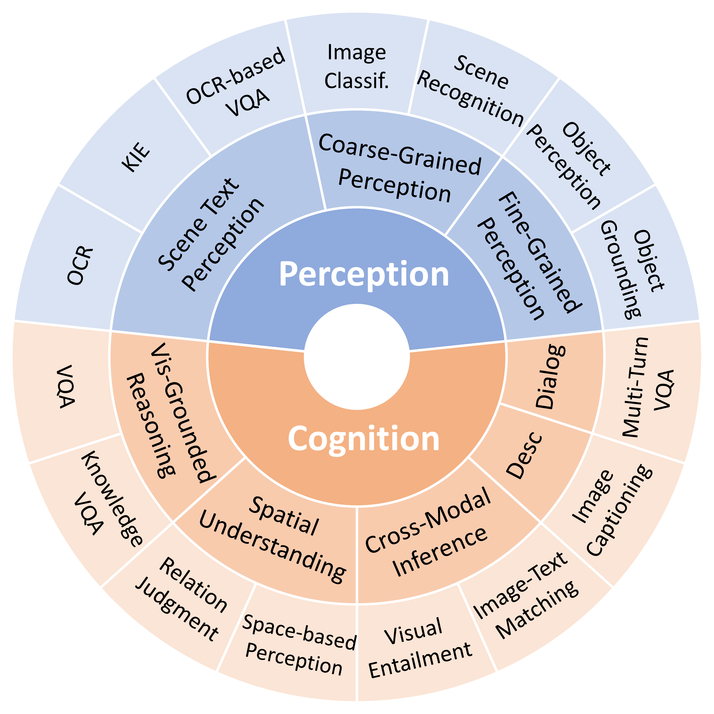

<div align="center">
  <h1 style="display: inline-block; font-size: 48px;">ReForm-Eval</h1>
  
</div>

<p align="center">
    
    
    
    
</p>

<div align="center">
  <h2 >ReForm-Eval: EVALUATING LARGE VISION LANGUAGE MODELS VIA UNIFIED RE-FORMULATION OF TASK-ORIENTED BENCHMARKS</h2>
</div>

<!-- <span style='font-size: 24px; font-weight: bold;'><p align='center'>ReForm-Eval: EVALUATING LARGE VISION LANGUAGE MODELS VIA UNIFIED RE-FORMULATION OF TASK-ORIENTED BENCHMARKS</p></span> -->

<p align="center"><strong>Zejun Li<sup>1</sup><sup>†</sup> , Ye Wang<sup>1</sup><sup>†</sup> , Mengfei Du<sup>1</sup><sup>†</sup> , Qingwen Liu<sup>1</sup><sup>†</sup> , Binhao Wu<sup>1</sup><sup>†</sup> , Jiwen Zhang<sup>1</sup><sup>†</sup> , Chengxing Zhou<sup>2</sup> , Zhihao Fan<sup>3</sup> , Jie Fu<sup>4</sup> , Jingjing Chen<sup>1</sup> , Xuanjing Huang<sup>1</sup> , Zhongyu Wei<sup>1</sup><sup>*</sup>.
 </strong></p>
<p align="center"><sup>1</sup>Fudan University      <sup>2</sup>Northeastern University      <sup>3</sup>Alibaba Group        <sup>4</sup>Hong Kong University of Science and Technology</p> 
<p align="center"><sup>†</sup>Equal Contribution        <sup>*</sup>Corresponding author</p> 

---

<p align="center">
  <a href="https://arxiv.org/abs/2310.02569v1">ReForm-Eval Paper</a> | <a href="https://huggingface.co/datasets/Aweminus/ReForm-Eval/tree/main">ReForm-Eval Dataset</a>
</p>

<!-- <div style="border-left: 2px solid #999; padding-left: 10px; margin-left: 10px; color: #666; font-size: 90%;">
Recent years have witnessed remarkable progress in the development of large vision-language models (LVLMs). Benefiting from the strong language backbones and efficient cross-modal alignment strategies, LVLMs exhibit surprising capabilities to perceive visual signals and perform visually grounded reasoning. However, the capabilities of LVLMs have not been comprehensively and quantitatively evaluated. Most existing multi-modal benchmarks require task-oriented input-output formats, posing great challenges to automatically assess the freeform text output of LVLMs. To effectively leverage the annotations available in existing benchmarks and reduce the manual effort required for constructing new benchmarks, we propose to re-formulate existing benchmarks into unified LVLM compatible formats. Through systematic data collection and reformulation, we present the ReForm-Eval benchmark, offering substantial data for evaluating various capabilities of LVLMs. Based on ReForm-Eval, we conduct extensive experiments, thoroughly analyze the strengths and weaknesses of existing LVLMs, and identify the underlying factors. Our benchmark and evaluation framework will be open-sourced as a cornerstone for advancing the development of LVLMs.
</div> -->

>Recent years have witnessed remarkable progress in the development of large vision-language models (LVLMs). Benefiting from the strong language backbones and efficient cross-modal alignment strategies, LVLMs exhibit surprising capabilities to perceive visual signals and perform visually grounded reasoning. However, the capabilities of LVLMs have not been comprehensively and quantitatively evaluated. Most existing multi-modal benchmarks require task-oriented input-output formats, posing great challenges to automatically assess the freeform text output of LVLMs. To effectively leverage the annotations available in existing benchmarks and reduce the manual effort required for constructing new benchmarks, we propose to re-formulate existing benchmarks into unified LVLM compatible formats. Through systematic data collection and reformulation, we present the ReForm-Eval benchmark, offering substantial data for evaluating various capabilities of LVLMs. Based on ReForm-Eval, we conduct extensive experiments, thoroughly analyze the strengths and weaknesses of existing LVLMs, and identify the underlying factors. Our benchmark and evaluation framework will be open-sourced as a cornerstone for advancing the development of LVLMs.

We explore ways of re-formulating existing benchmarks into unified formats that are compatible with LVLMs. Referring to the following figure, we adapt the evaluation process to the unified form shown in the lower part. 

<p align="center"></p>
Illustration of the unified re-formulation of existing benchmarks into multiple-choice problems. The text within square brackets indicates the evaluation methods, with red and green denoting incorrect and correct judgment, respectively. “EM” is short for exact match.
<!-- <h3 align="center"></h3> -->

<span style="font-size:larger;">**Existing LVLMs Evaluation:**</span>

- **No Quantification**: The capabilities of existing LVLMs are mainly demonstrated only by qualitative examples.
- **Task-Oriented**: Most existing multi-modal benchmarks can not be directly utilized to evaluate LVLMs since they are designed for specific tasks and rely on structured input-output formats for evaluation, even need to be fine-tuned or learn task-specific parameters.
- **Limited Samples**: Limited manual annotation such as around 100 samples per dimension in **MME** and **MMBench** could potentially introduce evaluation bias into the results.

<span style="font-size:larger;">**Based on the re-formulation framework, we present our unified multi-modal benchmark, ReForm-Eval:**</span>
- **Larger Data Scale**: ReForm-Eval provides a dataset scale almost **100 times larger** than existing benchmarks, allowing models to be comprehensively evaluated across various dimensions.

- **Without Manual Annotation**: ReForm-Eval leverages publicly open resources, reducing annotation costs while providing a larger-scale dataset.

- **Universal Evaluation**: Unlike **LVLM-ehub** which requires designing complex and dataset-specific evaluation strategies, ReForm-Eval offers greater scalability and a more universally applicable and efficient evaluation approach.

- **Comprehensive Evaluation**: We re-formulate **61 benchmark datasets** based on existing data resources, the evaluation dimensions range from basic visual perception to high-level visual reasoning and dialog.

- **Unification**: Multi-modal benchmark datasets are re-formulated as **multiple-choice problems** or specialized **text generation problems**. Additionally, **generation-based black-box** and **likelihood-based white-box approaches** are implemented for evaluation.

The unified formulation enables universal and comprehensive evaluation. For each formulation, we design a consistent and reliable evaluation method. As mentioned in (Fu et al., 2023), current LVLMs may struggle to follow multiple-choice instructions, we propose both black-box and white-box approaches to assist: 

(1) Guiding LVLMs to output in desired formats through in-context learning; 

(2) Directly calculating the generation probability for options and selecting the one with the highest value. 

Considering the sensitivity of LVLMs to the input prompts (Zeng et al., 2023), we additionally design an instability-aware evaluation strategy and introduce a metric to characterize such instability. 

**ReForm-Eval serves as a reliable tool for quantitative analysis of LVLMs, aiding in the research and development of LVLMs.🔧🔧🔧**

## 📣 Update
- **[2023-10]** We released a version of the original paper containing 16 models and 61 reformulated datasets!

## 📖 Contents
- [Model Performance](#model-performance)
- [Prepare Dataset](build/prepare_dataset.md#prepare-dataset)
  - [Load Dataset from Hugging Face (Recommended)](build/prepare_dataset.md#load-dataset-from-hugging-face-recommended)
  - [Manually Download](build/prepare_dataset.md#manually-download)
- [Prepare Models](models/prepare_models.md#prepare-models)
  - [Set Up Existing Models](models/prepare_models.md#set-up-existing-models)
  - [Add Your Own Models](models/prepare_models.md#add-your-own-models)
  - [Preprocessors](models/prepare_models.md#preprocessors)
- [Usage](#usage)
  - [Demo](#demo)
  - [Parameters](#parameters)
  - [Model Usage](#model-usage)
  - [Data Usage](#data-usage)
- [Evaluation](#evaluation)
  - [Direct Evaluation](#direct-evaluation)
  - [Evaluation Using Our Benchmark](#evaluation-using-our-benchmark) 
- [Citation](#citation)
- [Related Projects](#related-projects)

## 🦾 Model Performance
We list the average ranking and score of the model under Generation Evaluation and Likelihood Evaluation in the table below. New models will be added soon.

| Model          | Gen-Avg-Rank | Gen-Avg-Score | Like-Avg-Rank | Like-Avg     |
|----------------|--------------|---------------|---------------|--------------|
| **BLIP-2**     | *2.3*          | **62.94**         | 4.3           | 62.92        |
| **InstructBLIP_F** | **2.0**      | *60.77*         | 4.0           | 63.48        |
| **InstructBLIP_V** | 4.4      | 52.20         | 3.0           | *64.37*        |
| **LLaVA_V**    | 11.1         | 34.24         | 8.7           | 55.49        |
| **LLaVA_L2**   | 5.9          | 45.78         | 11.2          | 52.97        |
| **MiniGPT4**   | 7.3          | 43.12         | 7.8           | 56.15        |
| **mPLUG-Owl**  | 10.6         | 37.95         | 10.3          | 53.69        |
| **PandaGPT**   | 13.9         | 26.84         | 15.8          | 41.80        |
| **ImageBindLLM** | 13.0       | 30.24         | 14.5          | 47.58        |
| **LA-V2**      | 12.5         | 32.60         | 12.2          | 50.00        |
| **mmGPT**      | 14.4         | 29.38         | 12.8          | 50.92        |
| **Shikra**     | 11.0         | 36.14         | 7.0           | 58.40        |
| **Lynx**       | 5.0          | 50.00         | *2.8*           | 63.93        |
| **Cheetor_V**  | 6.8          | 44.74         | 8.2           | 56.73        |
| **Cheetor_L2** | 7.9          | 41.75         | 10.7          | 52.43        |
| **BLIVA**      | 7.9          | 42.40         | **2.7**           | **64.92**        |

<!-- This table presents the comprehensive performance of each model across dimensions, from which several insights can be gleaned. 
(1) BLIP-2 and InstructBLIP continue to hold the top-2 positions in most dimensions, but in some individual dimensions, Lynx, BLIVA, and Shikra also take the lead. 
(2) It’s worth noting that the effectiveness of models like BLIVA and Lynx only becomes apparent when using likelihood evaluation. We suspect this is attributed to the instruction-following ability of models. 
(3) Compared to models based on CLIP visual encoders, PandaGPT and IB-LLM, which are based on the ImageBind encoder, exhibit relatively poorer performance in image-text tasks. Meanwhile, most top-performing models utilize Vicuna and FlanT5 as the backbone. 
(4) Apart from the architecture, a common characteristic among BLIP-2, InstructBLIP, Lynx, and BLIVA is the use of relatively high-quality data during pre-training.  -->

## 📥 Prepare Dataset
To address the wide range of questions posed by users, LVLMs need to possess diverse capabilities. For a comprehensive evaluation, we curate 61 benchmark datasets from existing resources, summarizing the assessed capabilities into 2 major categories and 8 sub-categories.

<p align="center"></p>
Assessed capability dimensions and tasks in ReForm-Eval. “Desc” and “Classif.” are respectively short for description and classification.


### Load Dataset from Hugging Face (Recommended)
You can load our dataset directly from our Hugging Face repository, avoiding the hassle of manual downloading, so this is also the most recommended method. If you want to read the raw json data directly, use the following code:
```python
from datasets import load_dataset
# You can add (field="data") in parameters for extracting "data" keys.
# Load from the Hugging Face page
dataset = load_dataset("Aweminus/ReForm-Eval",data_files={'test':'huggingface_data/MEDIC/disaster-type-selection-sampled.json'}, split='test') 
# Load from the local path
dataset = load_dataset("Aweminus/ReForm-Eval",data_files={'test':'/path/to/disaster-type-selection.json'}, split='test')
```
In our repository, `huggingface_data` is already set in `./build/configs/DisasterType_val.yaml` as shown below:
```YAML
dataset: 'MEDIC'
task: 'dts' # disaster type selection
data_config:
  load_from_bootstrap: True
  image_path: "/remote-home/share/multimodal-datasets/raw_datasets/MEDIC/data"
  medic_path: "/remote-home/share/multimodal-datasets/Gen_Eval/Disaster-Type-Selection/disaster-type-selection-sampled.json" 
  huggingface_data: "huggingface_data/MEDIC/disaster-type-selection-sampled.json" # the path of hugging face data
```

And in `./build/MEDIC/disaster_type_dataset.py`, the hugging data path is read directly from the config file, so no changes are needed.
```python
    if args.hf:
        data = load_dataset("Aweminus/ReForm-Eval",data_files={'test':self.config['huggingface_data']}, split='test')
```

If you cannot access hugging face, you can use the following command to download the dataset, and then load the dataset locally still with a single line of code.
```bash
git lfs install
git clone https://huggingface.co/datasets/Aweminus/ReForm-Eval
```

Then you need to modify `huggingface_data` to the local path of the dataset:
```YAML
dataset: 'MEDIC'
task: 'dts' # disaster type selection
data_config:
  load_from_bootstrap: True
  image_path: "/remote-home/share/multimodal-datasets/raw_datasets/MEDIC/data"
  medic_path: "/remote-home/share/multimodal-datasets/Gen_Eval/Disaster-Type-Selection/disaster-type-selection-sampled.json" 
  huggingface_data: "/path/to/disaster-type-selection.json" # The place you need to modify (the local path of hugging face data)
```

### Manually Download
Alternatively, all datasets are also provided with URLs and you can manually download them.

| Dataset          | URL                                                                          |
|------------------|-------------------------------------------------------------------------------|
| AOKVQA           | [https://prior-datasets.s3.us-east-2.amazonaws.com/aokvqa/aokvqa_v1p0.tar.gz](https://prior-datasets.s3.us-east-2.amazonaws.com/aokvqa/aokvqa_v1p0.tar.gz) |
| CIFAR10          | [http://www.cs.toronto.edu/~kriz/cifar.html](http://www.cs.toronto.edu/~kriz/cifar.html)                              |
| CLEVR            | [https://dl.fbaipublicfiles.com/clevr/CLEVR_v1.0.zip](https://dl.fbaipublicfiles.com/clevr/CLEVR_v1.0.zip)                   |
| COCO_text        | [https://s3.amazonaws.com/cocotext/COCO_Text.zip](https://s3.amazonaws.com/cocotext/COCO_Text.zip)                        |
| CUTE80           | [http://cs-chan.com/downloads_CUTE80_dataset.html](http://cs-chan.com/downloads_CUTE80_dataset.html)                        |
| Flickr30K        | [http://shannon.cs.illinois.edu/DenotationGraph/data/index.html](http://shannon.cs.illinois.edu/DenotationGraph/data/index.html)        |
| Flowers102       | [https://www.kaggle.com/datasets/nunenuh/pytorch-challange-flower-dataset](https://www.kaggle.com/datasets/nunenuh/pytorch-challange-flower-dataset) |
| FUNSD            | [https://guillaumejaume.github.io/FUNSD/download/](https://guillaumejaume.github.io/FUNSD/download/)                        |
| IC15             | [http://rrc.cvc.uab.es/?ch=4&com=downloads](http://rrc.cvc.uab.es/?ch=4&com=downloads)                                |
| IIIT5K           | [https://cvit.iiit.ac.in/research/projects/cvit-projects/the-iiit-5k-word-dataset](https://cvit.iiit.ac.in/research/projects/cvit-projects/the-iiit-5k-word-dataset) |
| ImageNet1K       | [https://www.image-net.org/update-mar-11-2021.php](https://www.image-net.org/update-mar-11-2021.php)                          |
| MEDIC            | [https://crisisnlp.qcri.org/data/medic/MEDIC.tar.gz](https://crisisnlp.qcri.org/data/medic/MEDIC.tar.gz)                       |
| MOCHEG           | [https://docs.google.com/forms/d/e/1FAIpQLScAGehM6X9ARZWW3Fgt7fWMhc_Cec6iiAAN4Rn1BHAk6KOfbw/viewform?usp=sf_link](https://docs.google.com/forms/d/e/1FAIpQLScAGehM6X9ARZWW3Fgt7fWMhc_Cec6iiAAN4Rn1BHAk6KOfbw/viewform?usp=sf_link) |
| MP3D             | [https://niessner.github.io/Matterport/](https://niessner.github.io/Matterport/)                                   |
| MSCOCO           | [http://images.cocodataset.org/zips/val2017.zip](http://images.cocodataset.org/zips/val2017.zip)                           |
| NLVR             | xxx                                                                         |
| NoCaps           | [https://nocaps.s3.amazonaws.com/nocaps_val_4500_captions.json](https://nocaps.s3.amazonaws.com/nocaps_val_4500_captions.json)           |
| Pets37           | [https://www.robots.ox.ac.uk/~vgg/data/pets/](https://www.robots.ox.ac.uk/~vgg/data/pets/)                              |
| POIE             | [https://drive.google.com/file/d/1eEMNiVeLlD-b08XW_GfAGfPmmII-GDYs/view](https://drive.google.com/file/d/1eEMNiVeLlD-b08XW_GfAGfPmmII-GDYs/view)  |
| RefCOCO          | [https://bvisionweb1.cs.unc.edu/licheng/referit/data/refcoco.zip](https://bvisionweb1.cs.unc.edu/licheng/referit/data/refcoco.zip)          |
| RefCOCO+         | [https://bvisionweb1.cs.unc.edu/licheng/referit/data/refcoco+.zip](https://bvisionweb1.cs.unc.edu/licheng/referit/data/refcoco+.zip)         |
| RefCOCOg         | [https://bvisionweb1.cs.unc.edu/licheng/referit/data/refcocog.zip](https://bvisionweb1.cs.unc.edu/licheng/referit/data/refcocog.zip)         |
| SNLI_VE          | [https://github.com/necla-ml/SNLI-VE](https://github.com/necla-ml/SNLI-VE)                                      |
| SROIE            | [https://rrc.cvc.uab.es/?ch=13&com=downloads](https://rrc.cvc.uab.es/?ch=13&com=downloads)                              |
| TDIUC            | [https://kushalkafle.com/projects/tdiuc.html](https://kushalkafle.com/projects/tdiuc.html)                              |
| TextCaps         | [https://dl.fbaipublicfiles.com/textvqa/images/train_val_images.zip](https://dl.fbaipublicfiles.com/textvqa/images/train_val_images.zip)      |
| TextCaps JSON    | [https://dl.fbaipublicfiles.com/textvqa/data/textcaps/TextCaps_0.1_val.json](https://dl.fbaipublicfiles.com/textvqa/data/textcaps/TextCaps_0.1_val.json) |
| TextOCR          | [https://textvqa.org/textocr/dataset/](https://textvqa.org/textocr/dataset/)                                    |
| VisDIal          | [https://visualdialog.org/data](https://visualdialog.org/data)                                           |
| VizWiz           | [https://vizwiz.org/tasks-and-datasets/vqa/](https://vizwiz.org/tasks-and-datasets/vqa/)                              |
| VQA              | [https://visualqa.org](https://visualqa.org)                                                    |
| VSR              | [https://github.com/cambridgeltl/visual-spatial-reasoning/tree/master/data](https://github.com/cambridgeltl/visual-spatial-reasoning/tree/master/data) |
| WikiHow          | [https://drive.google.com/u/0/uc?id=1vnDduJmuFpeT8yTgtBR9Bj8bXlI4zIJR&export=download](https://drive.google.com/u/0/uc?id=1vnDduJmuFpeT8yTgtBR9Bj8bXlI4zIJR&export=download) |
| Winoground       | [https://huggingface.co/datasets/facebook/winoground](https://huggingface.co/datasets/facebook/winoground)                     |
| WordArt          | [https://drive.google.com/file/d/1SanxRwTxd2q](https://drive.google.com/file/d/1SanxRwTxd2q)|


After downloading the all dataset, you need to modify all paths of config files in `./datasets/configs/`.
```YAML
dataset: 'MEDIC'
task: 'dts' # disaster type selection
data_config:
  load_from_bootstrap: True
  image_path: "/remote-home/share/multimodal-datasets/raw_datasets/MEDIC/data" #The place you need to modify
  medic_path: "/remote-home/share/multimodal-datasets/Gen_Eval/Disaster-Type-Selection/disaster-type-selection-sampled.json" #The place you need to modify
  huggingface_data: "huggingface_data/MEDIC/disaster-type-selection-sampled.json"
```

## 🤖 Prepare Models

### Set Up Existing Models
We conduct a comprehensive evaluation of 16 open-source LVLMs across various capability dimensions. All LVLMs are provided with checkpoints. To build the environment for each model, you can create conda envs for corresponding models and directly copy the installation command of Bash Shell in `./models/build_scripts/` and paste it in the terminal to install required packages.

| Model            | URL                                                           |
|------------------|---------------------------------------------------------------|
| BLIP-2           | [https://github.com/salesforce/LAVIS/tree/main/projects/blip2](https://github.com/salesforce/LAVIS/tree/main/projects/blip2) |
| InstructBLIP     | [https://github.com/salesforce/LAVIS/tree/main/projects/instructblip](https://github.com/salesforce/LAVIS/tree/main/projects/instructblip) |
| LLaVA-Vicuna     | GitHub:[https://github.com/haotian-liu/LLaVA/tree/main](https://github.com/haotian-liu/LLaVA/tree/main)<br>Model:[https://huggingface.co/liuhaotian/LLaVA-7b-delta-v0](https://huggingface.co/liuhaotian/LLaVA-7b-delta-v0) |
| LLaVA-LLaMA2     | GitHub:[https://github.com/haotian-liu/LLaVA/tree/main](https://github.com/haotian-liu/LLaVA/tree/main)<br>Model:[https://huggingface.co/liuhaotian/llava-llama-2-7b-chat-lightning-lora-preview](https://huggingface.co/liuhaotian/llava-llama-2-7b-chat-lightning-lora-preview) |
| MiniGPT4         | GitHub:[https://github.com/Vision-CAIR/MiniGPT-4](https://github.com/Vision-CAIR/MiniGPT-4)<br>Model:[https://drive.google.com/file/d/1RY9jV0dyqLX-o38LrumkKRh6Jtaop58R/view](https://drive.google.com/file/d/1RY9jV0dyqLX-o38LrumkKRh6Jtaop58R/view) |
| mPLUG-Owl        | GitHub:[https://github.com/X-PLUG/mPLUG-Owl](https://github.com/X-PLUG/mPLUG-Owl)<br>Model:[https://huggingface.co/MAGAer13/mplug-owl-llama-7b](https://huggingface.co/MAGAer13/mplug-owl-llama-7b) |
| PandaGPT         | [https://github.com/yxuansu/PandaGPT](https://github.com/yxuansu/PandaGPT) |
| IB-LLM           | [https://github.com/OpenGVLab/LLaMA-Adapter/tree/main/imagebind_LLM](https://github.com/OpenGVLab/LLaMA-Adapter/tree/main/imagebind_LLM) |
| LA-V2            | [https://github.com/OpenGVLab/LLaMA-Adapter/tree/main/llama_adapter_v2_multimodal7b](https://github.com/OpenGVLab/LLaMA-Adapter/tree/main/llama_adapter_v2_multimodal7b) |
| mmGPT            | [https://github.com/open-mmlab/Multimodal-GPT](https://github.com/open-mmlab/Multimodal-GPT) |
| Shikra           | GitHub:[https://github.com/shikras/shikra](https://github.com/shikras/shikra)<br>Model:[https://huggingface.co/shikras/shikra-7b-delta-v1](https://huggingface.co/shikras/shikra-7b-delta-v1) |
| Lynx             | [https://github.com/bytedance/lynx-llm](https://github.com/bytedance/lynx-llm) |
| Cheetor-Vicuna   | GitHub:[https://github.com/DCDmllm/Cheetah](https://github.com/DCDmllm/Cheetah)<br>Model:[https://drive.google.com/file/d/1mBiMzyY468QWUix8CuCvuByVEs9yfYPu/view](https://drive.google.com/file/d/1mBiMzyY468QWUix8CuCvuByVEs9yfYPu/view) |
| Cheetor-LLaMA2   | GitHub:[https://github.com/DCDmllm/Cheetah](https://github.com/DCDmllm/Cheetah)<br>Model:[https://drive.google.com/file/d/1kzpbvcFdq1XxAGSPbqPMmsjwi-etJ5Yi/view](https://drive.google.com/file/d/1kzpbvcFdq1XxAGSPbqPMmsjwi-etJ5Yi/view) |
| BLIVA            | GitHub:[https://github.com/mlpc-ucsd/BLIVA](https://github.com/mlpc-ucsd/BLIVA)<br>Model:[https://huggingface.co/mlpc-lab/BLIVA_Vicuna](https://huggingface.co/mlpc-lab/BLIVA_Vicuna) |

Only when multiple models exist at the same time, both of the GitHub URL and the model URL are provided.

### Add Your Own Models
To add new models, you need to create the corresponding model interface for the unified evaluation. For a general new model interface, please refer to the interface template in `./models/interfaces/base_interface.py`. Here we provide a step-by-step guide for the convenience of your implementation (taking Lynx as an example).

#### Step 1: Configure the Code Path
Add the Lynx project as a submodule to `./models/interfaces/`:
```bash
cd models/interfaces
git submodule add https://github.com/bytedance/lynx-llm.git
```

#### Step 2: Model Loading
Refer to the code for loading the model in the original Lynx project.
```python
def main(args, config):
    print("### Evaluating", flush=True)
    device = torch.device(args.device)

    seed = args.seed + utils.get_rank()
    torch.manual_seed(seed)
    np.random.seed(seed)
    random.seed(seed)
    cudnn.benchmark = True

    print("config:", json.dumps(config), flush=True)
    print("output_path, ", args.output_path, flush=True)

    print("### Creating model", flush=True)
    from models.lynx import LynxBase
    model = LynxBase(config=config, freeze_vit=config['freeze_vit'], freeze_llm=config['freeze_llm'], load_bridge=False)
```

So, we can implement the `__init__` function for model loading in our interface:
```python
class Lynx_Interface(nn.Module):
    def __init__(self, model_config=None, device=None, half=False, inference_method='generation') -> None:
        super(Lynx_Interface, self).__init__()
        # setup the model device
        if device is None:
            self.device = torch.device("cuda" if torch.cuda.is_available() else "cpu")
        else:
            self.device = torch.device(device)
        
        # loading the model
        self.config = yaml.load(open(model_config, 'r'), Loader=yaml.Loader)
        self.model = LynxBase(config=self.config, freeze_vit=self.config['freeze_vit'], freeze_llm=self.config['freeze_llm'], load_bridge=False)
        
        # locate the model to half-precision and target device if needed
        self.prec_half = half
        if self.prec_half:
            self.model = self.model.half()
        self.model = self.model.to(self.device)
        
        # setup the inference method
        self.inference_method = inference_method
```

#### Step 3: Implement the Inference Function
**Generation-based Black-Box Evaluation**
After that, find the generation-related code in the original Lynx project.
```python
@torch.no_grad()
def evaluation(model, data_loader, device, config):
    # test
    model.eval()
    result = []

    for n, (idx, vision_input, input_ids, input_atts) in enumerate(data_loader):
        vision_input = vision_input.to(device, non_blocking=True)
        input_ids = input_ids.to(device)
        input_atts = input_atts.to(device)

        text_outputs = model.generate(
            vision_input=vision_input,
            input_ids=input_ids, input_atts=input_atts,
            use_nucleus_sampling=config.get('use_nucleus_sampling', False),
            apply_lemmatizer=config['apply_lemmatizer'],
            num_beams=config['num_beams'],
            min_length=config['min_length'],
            length_penalty=config.get('length_penalty', 1.0),
            no_repeat_ngram_size=config.get('no_repeat_ngram_size', -1),
            top_p=config.get('top_p', 0.9),
            top_k=config.get('top_k', 3),
            max_new_tokens=config.get('max_new_tokens', 64))

        for i, output in zip(idx, text_outputs):
            result.append({"index": i, "text_output": output.strip()})

    return result
```

Therefore, in `lynx_interface.py`, we can implement the generation inference function as:
```python
    @torch.no_grad()
    def raw_generate(self, image, prompt, temperature=1, max_new_tokens=30):
        vision_input = self.load_vision_inp(image).unsqueeze(0)
        if self.prec_half:
            vision_input = vision_input.to(torch.float16)
        
        input_ids, input_atts = self.process_text(prompt)
        
        answer = self.model.generate(
            vision_input=vision_input,
            input_ids=input_ids, input_atts=input_atts,
            use_nucleus_sampling=self.config.get('use_nucleus_sampling', False),
            apply_lemmatizer=self.config['apply_lemmatizer'],
            num_beams=3, # self.config['num_beams'],
            min_length=self.config['min_length'],
            length_penalty=self.config.get('length_penalty', 1.0),
            no_repeat_ngram_size=self.config.get('no_repeat_ngram_size', -1),
            top_p=self.config.get('top_p', 0.9),
            top_k=self.config.get('top_k', 3),
            max_new_tokens=max_new_tokens,
            temperature=temperature)

        return answer[0]
```

In this function, you have to use the internal vision processor to get the vision input (open and get the image), and the internal tokenizer to get the input_ids and input_atts. All of these codes can be directly found and implemented from the original project.
```python
    def load_vision_inp(self, vision_inp):
        if vision_inp is None:
            return None

        elif isinstance(vision_inp, list) or isinstance(vision_inp, np.ndarray):
            return self._get_frames(vision_inp)

        elif isinstance(vision_inp, str):

            if os.path.exists(vision_inp):
                image = Image.open(vision_inp).convert('RGB')

            else:  # base64 encoding
                try:
                    image = Image.open(io.BytesIO(b64decode(vision_inp))).convert("RGB")
                except Exception as e:
                    raise ValueError(f"check whether it is a rpath (and not exist)?: {vision_inp} {e}")
        else:
            image = vision_inp
        
        image = self.img_transform(image)

        return image.to(self.device)
    
    def process_text(self, text):
        text = text.strip()
        if self.lower_text:
            text = text.lower()
        input_ids = [self.tokenizer.bos_token] + self.tokenizer.tokenize(text)
        # print(input_ids)
        input_ids = self.tokenizer.convert_tokens_to_ids(input_ids)
        input_atts = torch.LongTensor([[1]*len(input_ids)])
        input_ids = torch.LongTensor([input_ids])
        return input_ids.to(self.device), input_atts.to(self.device)
```

**Likelihood-based Black-Box Evaluation**
To support the likelihood evaluation, we add the following function in our model file `./models/interfaces/lynx/models/lynx.py` to calculate the loss (neg-log likelihood) for each sequence.
```python
    def forward_likelihood(self, vision_input, input_ids, input_atts, labels, likelihood_reduction='sum'):
        text_embeds = self.embed_tokens(input_ids)

        if vision_input is not None:
            vision_embeds, vision_atts = self.get_vision_embeds(vision_input)
            v2t_feats, v2t_atts = self.bridge(vision_embeds=vision_embeds, vision_atts=vision_atts)

            inputs_embeds = torch.cat([v2t_feats, text_embeds], dim=1)
            attention_mask = torch.cat([v2t_atts, input_atts], dim=1)

        else:
            inputs_embeds = text_embeds
            attention_mask = input_atts

        outputs = self.LLM(
            inputs_embeds=inputs_embeds,
            attention_mask=attention_mask,
            labels=labels,
            return_dict=True,
            reduction='none'
        )
        loss = outputs.loss.reshape(inputs_embeds.shape[0], -1)
        if likelihood_reduction == 'sum':
            loss = loss.sum(1)
        elif likelihood_reduction == 'mean':
            valid_num_targets = (loss > 0).sum(1)
            loss = loss.sum(1) / valid_num_targets
        elif likelihood_reduction == 'none':
            loss = loss
        else:
            raise ValueError
        return loss
```

Hence, in `lynx_interface.py`, we can use `self.model.forward_likelihood` at the `raw_predict` function.
```python
    def raw_predict(self, image, prompt, candidates, likelihood_reduction='sum'):
        # loading the image-text pair
        vision_input = self.load_vision_inp(image).unsqueeze(0)
        if self.prec_half:
            vision_input = vision_input.to(torch.float16)
        
        input_ids, attention_mask = self.process_text(prompt)
        
        # get the embedding from the input
        num_cand = len(candidates)
        input_seq_len = input_ids.shape[1]

        # tokenize the candidates
        current_padding_side = self.tokenizer.padding_side
        current_truncation_side = self.tokenizer.truncation_side
        self.tokenizer.padding_side = 'right'
        self.tokenizer.truncation_side = 'right'
        if self.lower_text:
            candidates = [cand.lower() for cand in candidates]
        candidates_tokens = self.tokenizer(
            candidates,
            return_tensors='pt',
            padding='longest'
        ).to(self.device)
        self.tokenizer.padding_side = current_padding_side
        self.tokenizer.truncation_side = current_truncation_side

        # construct the inputs_ids and LM targets
        candidates_ids = candidates_tokens.input_ids[:, 1:] # remove the <s> token
        candidates_att = candidates_tokens.attention_mask[:, 1:] # remove the <s> token
        # mask the LM targets with <pad>
        cand_targets = candidates_ids.clone()
        cand_targets = cand_targets.masked_fill(cand_targets == self.tokenizer.pad_token_id, -100)
        # mask the targets for inputs part
        targets = torch.cat([-100*torch.ones(num_cand, input_seq_len+self.config["num_bridge_tokens"], dtype=torch.long, device=self.device), \
                             cand_targets], dim=1)
        # concatenate the inputs for the model
        attention_mask = torch.cat([attention_mask.repeat_interleave(num_cand, dim=0), candidates_att], dim=1)
        full_input_ids = torch.cat([input_ids.repeat_interleave(num_cand, dim=0), candidates_ids], dim=1)
        
        # calculate the loss (neg-log likelihood) for each candidate
        with torch.inference_mode():
            outputs = self.model.forward_likelihood(
                vision_input=vision_input.repeat_interleave(num_cand, dim=0),
                input_ids=full_input_ids,
                input_atts=attention_mask,
                labels=targets,
                likelihood_reduction=likelihood_reduction
            )
        neg_likelihood = outputs
        # select the one with the highest likelihood / lowest loss
        output_class_ranks = torch.argsort(neg_likelihood, dim=-1)[0].item()

        return output_class_ranks
```

#### Step 4: Implement the Preprocessor
Preprocessors are used to formulate the structural information in order to get the correct form of dialogue. Our preprocessor is in `./utils/preprocessors.py`.
```python
class ConvSingleChoiceProcessor(object):
    def __init__(self, sep, sep2=None, roles=['Question', 'Answer'], system_msg=None, first_query_fn=None, \
                 init_conv=None, sep_style='two', alphabet_choice=None, infer_method='generation', response_prefix=None):
        """
        Preprocessors to convert input information into a dialogue string
        
        Args:
            sep (str):
                The text separator-1.
            sep2 (str):
                The text separator-2.
            roles (list[str]):
                Role names of the dialogue, roles[0] is the role of users while 
                roles[1] is the name of assistants.
            system_msg (str, **optional**):
                The system message that appears at the beginning.
            first_query_fn (function, **optional**):
                The function to process the first query, mainly for adding  marks.
            init_conv (list[list[str]]):
                The initial conversation. Each element is a list[str, str] where the first
                is the role name and the second is the message. 
            sep_style (str):
                The dialogue style. 
            alphabet_choice (str, **optional**):
                The option mark used for multiple-choice questions, defaults to "random"
            infer_method (str, "optional"):
                The inference method ("generation" or "likelihood")
            response_prefix (str, **optional**):
                The prefix text for the response of LVLM assistants, we use "The answer is"
                to help with multiple-choice questions.
                
        Returns:
            output (str):
                The constructed dialogue text.
        """
```

Here is an example of the `\n`-separated preprocessor:
```python
proc = ConvSingleChoiceProcessor('\n', roles=['User', 'Bot'], first_query_fn=lambda x: "<image> "+x,
                                sep_style='one', infer_method=model_args['inference_method'], response_prefix='The answer is',
                                system_message="A chat between a curious human and an artificial intelligence assistant. The 
                                assistant gives helpful, detailed, and polite answers to the human's questions.")
```

The input sample is a json-style dict:
```
inputs = {'sample_id': '287626_3',
 'round_id': 3,
 'image': 'IMAGE_PATH.jpg',
 'question': 'Is there a cat in the image?',
 'answer': '2',
 'answer_options': ['yes', 'no', 'maybe'],
 'history': [{'from': 'human', 'value': 'Can you see the image? Options: (A) yes; (B) no'},
             {'from': 'assistant', 'value': 'The answer is (A) yes'}]
}
```

Therefore, the final content will be:
```
A chat between a curious human and an artificial intelligence assistant. The assistant gives helpful, detailed, and polite answers to the human's questions.
User: <image> Can you see the image? Options: (A) yes; (B) no.\n
Bot: The answer is (A) yes\n
User: Is there a cat in the image? Options: (A) yes; (B) no; (C) maybe.\n
Bot: The answer is
```

For other supported sep_style, please refer to `./utils/preprocessors.py`.
`init_conv` can also be used to add `<image>` marks, if it is `init_conv=[['User', "<image>"]]`, this means that a new conversation will be started.

```
User: <image>
User: ......
Bot: ......
```

#### Step 5: Add Model Loader
Implement the model loading function in `./models/interfaces/lynx_interface.py`.
```python
def get_lynx(model_config=None):
    model_args = {}
    # map the general input arguments to the model-specific arguments
    if model_config is not None:
        valid_args = ['model_name', 'device', 'half', 'inference_method']
        target_args = ['model_config', 'device', 'half', 'inference_method']
        for i, arg in enumerate(valid_args):
            if arg in model_config:
                model_args[target_args[i]] = model_config[arg]
    # configure the dialogue preprocessor
    proc = ConvSingleChoiceProcessor('\n', roles=['User', 'Bot'], \
                                     sep_style='one', infer_method=model_args['inference_method'], response_prefix='The answer is')
    return Lynx_Interface(**model_args), proc
```

Additionally, you should add the following codes in  `./models/__init__.py`.
```python
    elif model_name == 'lynx':
        from .interfaces.lynx_interface import get_lynx
        return get_lynx(model_config)
```

#### Done!
Finally, you can use the following model arguments in the main entrance to evaluate your model!
```bash
--model lynx  --model_name models/interfaces/lynx/configs/LYNX.yaml
```

If you have trouble incorporating new models into our framework, please let us know through GitHub issues or emails.

### Preprocessors
We give a brief introduction to preprocessors in order to get the correct form of dialogue. Our preprocessor is in `./utils/preprocessors.py`.
```python
class SingleChoiceProcessor(object):
    def __init__(self, sep, sep2=None, roles=['Question', 'Answer'], alphabet_choice=None, infer_method='generation'):
        self.sep = sep
        self.sep2 = sep2
        self.roles = roles
        if alphabet_choice is not None:
            if alphabet_choice == 'number':
                self.ab = alphabet[2]
            elif alphabet_choice == 'lower':
                self.ab = alphabet[0]
            elif alphabet_choice == 'upper':
                self.ab = alphabet[1]
            else:
                raise ValueError
        else:
            self.ab = alphabet
        self.infer_method = infer_method
```

There are different sep styles in these models, and we mainly classify them into three categories, which are `sep_style='one', 'two' or others`, respectively.
If you set the `sep_style='one'`, parameters should be set similar to this:
```python
proc = ConvSingleChoiceProcessor('\n', roles=['User', 'Bot'], \
                                sep_style='one', infer_method=model_args['inference_method'], response_prefix='The answer is')
```

`\n` represents whether it is a `User` or a `Bot`, the conversation will end with `\n`. 
`roles` represents whether this round of dialogue is User or Bot, and a semicolon `:` will be added after the specific role. 
`response_prefix` is that the final answer will first add the text `The answer is`.
Therefore, the final content will be:
```
User: ......
Bot: ......
User: ......
Bot: The answer is ......
```

If `sep_style='two'`, `sep=' '` and `sep2='\n'` represents when it is a User, the conversation will end with `' '` and when it is a Bot, the conversation will end with `\n`.
`system_msg` denotes that a paragraph needed to start the entire conversation, something like `Below is an instruction that describes a task, paired with an input that provides further context. Write a response that appropriately completes the request.`
`first_query_fn` is the content only appended after the first `Human:`, which is usually used to add `` or `</img>`, etc.
`init_conv` is similar to `first_query_fn`, but for example, if it is `init_conv=[['Human', "<image>"]]`, this means that a new conversation will be started.

```
Human: <image>
Human: ......
AI: ......
```

`instruct` content occasionally appears, but it will be automatically added to the final text in the preprocess function. Besides, you can also simply add your own sep styles if you need.

## 🔰 Usage
Before performing the evaluation, please refer to Prepare Your Data and Prepare Your Model. Our benchmark supports multi-GPU evaluation. If the half evaluation is set, the evaluation can be run on a single machine within CUDA memory of 24G on a single card for 7B models under limited equipment conditions.

### Demo
We provide one example of running the benchmark test, using Lynx model for VisDial Evaluation.
```bash
CUDA_VISIBLE_DEVICES=0,1 torchrun --nproc_per_node=2 run_eval.py \
    --model lynx  --model_name models/interfaces/lynx/configs/LYNX.yaml \
    --dataset_name VisDial --output_dir output/lynx/VisDial/test_generation/ \
    --per_gpu_eval_batch_size 4 --formulation SingleChoice \
    --infer_method generation --do_eval --half_evaluation  --dataset_duplication 1 \
    --in_context_sample --option_mark upper \
    --dataset_config datasets/configs/VisDial_val_v1.2.yaml \
```

The num of `--nproc_per_node` must be equal to the num of `CUDA_VISIBLE_DEVICES`. 
`--output_dir` is the path of output result. 
`--formulation` must be `Generation` or `SingleChoice`. 
`--infer_method` must be `generation` or `likelihood`. 
If you infer in generation mode, you should use `--in_context_sample` to assist models to generate option marks for most questions. 
`--dataset_config` is the path of the dataset config file.

### Parameters
```python
def main():
    parser = argparse.ArgumentParser()
    # model-related parameters
    parser.add_argument('--model', type=str, default=None, help='the model family name')
    parser.add_argument('--model_name', type=str, default=None, help='the model name to load')
    parser.add_argument('--model_type', type=str, default=None, help='the model type to set')
    # dataset-related parameters
    parser.add_argument('--dataset_name', type=str, default=None, help='the dataset name to evaluate on')
    parser.add_argument('--formulation', type=str, default=None, help='the problem formulation to perform, must be in ("Generation", "SingleChoice")')
    parser.add_argument('--dataset_config', type=str, default=None, help='the config file path, using the default path without explicit ')
    parser.add_argument('--dataset_duplication', type=int, default=1, help='duplicate the sample for evaluating the stability')
    parser.add_argument('--in_context_sample', action='store_true', help='whether to provide in-context-learning samples')
    parser.add_argument('--capitalize', action='store_true', help='whether to capitalize the qa')
    # 0805 add
    parser.add_argument('--yesno_instruct', action='store_true', help='whether add "please answer yes or no" to the full instruct')
    parser.add_argument('--answer_space_instruct', action='store_true', help='whether add answer space to the full instruct')
    # running parameters
    parser.add_argument('--per_gpu_eval_batch_size', type=int, default=1, help='the batch size per GPU')
    parser.add_argument('--num_workers', type=int, default=4, help='workers in dataloader')
    parser.add_argument('--half_evaluation', action='store_true', help='whether to use half precision for evluation')
    # general evaluation setup
    parser.add_argument('--do_eval', action='store_true', help='whether to evluate the output.')
    parser.add_argument('--eval_stability', action='store_true', help='whether to evaluate the stability')
    # parameters for model generation
    parser.add_argument('--temperature', type=float, default=None, help='the temperature for generation')
    parser.add_argument('--max_new_tokens', type=int, default=None, help='max new tokens to generate')
    # parameters for likelihood measurement
    parser.add_argument('--likelihood_reduction', type=str, default=None, help='the reduction method for likelihood measurement')
    # parameters for SingleChoice problem
    parser.add_argument('--infer_method', type=str, default='generation', help='the inference method to use, must be in ["generation", "likelihood"]')
    parser.add_argument('--option_mark', type=str, default=None, help='the index mark for options in single-shoice questions, \
                        "number" for (1,2,3,4), "lower" for (a,b,c,d) while "upper" for (A,B,C,D)')
    # parameters for randomness control
    parser.add_argument('--random_instruct', action='store_true', help='whether to use random instructions')
    parser.add_argument('--shuffle_options', action='store_true', help='whether to shuffle options')
    # parameters for multi-round problem
    parser.add_argument('--options_in_history', action='store_true', help='whether to put options in history.')
    parser.add_argument('--online_multi_round', action='store_true', help='make online update to the history during dialog')
    parser.add_argument('--multi_round_eval', action='store_true', help='whether to evaluate multi-round performance')
    # output setup
    parser.add_argument('--output_dir', type=str, default='./output/', help='the path to save the output')
    # debug mode
    parser.add_argument('--dataset_debug', action='store_true', help='debug on the dataset setup')
    parser.add_argument('--dataset_subsample', type=int, default=None, help='only n sub-samples of the dataset')
    # core
    parser.add_argument('--core_eval', action='store_true', help='only eval on the core datasets')
    # hugging face
    parser.add_argument('--hf', action='store_true', help='whether to load the dataset directly from Hugging Face')
    args = parser.parse_args()
```

All parameters used are listed above and you can modify any parameter to customize your evaluation settings.

### Model Usage
For model-related parameters, we list required parameters of all 16 models. When running the evaluation, these commands must be applied for specific models.

#### BLIP-2 + InstructBLIP
```bash
# BLIP-2 flant5
--model blip2  --model_name blip2_t5  --model_type pretrain_flant5xl
# InstructBLIP flan-t5
--model blip2  --model_name blip2_t5_instruct  --model_type flant5xl
# InstructBLIP vicuna
--model blip2  --model_name blip2_vicuna_instruct  --model_type vicuna7b
```
#### LLaVA
```bash
# LLaVA v0
--model llava  --model_name /path/to/LLaVA-7B-v0/
# LLaVA llama-2
--model llava  --model_name /path/to/llava-llama-2-7b-chat-lightning-lora-preview/ \
--model_type /path/to/Llama-2-7b-chat-hf/
```
#### MiniGPT-4
```bash
--model minigpt4  --model_name models/MiniGPT-4/eval_configs/minigpt4_eval.yaml
```

In `./models/MiniGPT-4/eval_configs/minigpt4_eval.yaml`, you have to set:
```YAML
ckpt: '/path/to/prerained_minigpt4_7b.pth'
```

In `./models/interfaces/minigpt4/configs/models/minigpt4.yaml`, you need to set:
```YAML
# Vicuna
llama_model: "/path/to/vicuna-7B-v0/"
```
#### mPLUG-owl
```bash
--model mplugowl  --model_name mplugowl --model_type /path/to/mplug-owl-llama-7b/
```
#### LLaMA-Adapter V2
```bash
--model llama_adapterv2  --model_name llama_adapterv2  --model_type /path/to/pyllama_data
```
#### ImageBind-LLM
```bash
--model imagebindLLM  --model_name imagebindLLM --model_type /path/to/imagebindllm_ckpts
```

You need to modify the ImageBindLLM interface:
```python
class imagebindLLM_Interface(nn.Module):
    def __init__(self, model_name='imagebindLLM', model_path='/path/to/imagebindllm_ckpts', device=None, half=False, inference_method='generation') -> None:
        super(imagebindLLM_Interface, self).__init__()
        if device is None:
            self.device = torch.device("cuda" if torch.cuda.is_available() else "cpu")
        else:
            self.device = torch.device(device)

        self.model_name = model_name
        self.llama_dir = '/path/to/pyllama_data' # The modification place
        self.pretrained_ckpt = model_path
        self.prec_half = half
```

In `/path/to/imagebindllm_ckpts`, you need to include the following ckpts:
```YAML
imagebindllm_ckpts
- 7B.pth
- imagebind_w3D.pth
- knn.index
- PointTransformer_8192point.yaml
```
#### PandaGPT
```bash
--model pandagpt  --model_name pandagpt --model_type /path/to/pandagpt_pretrained_ckpt/
```

`/path/to/pandagpt_pretrained_ckpt` includes three folders, which are `imagebind_ckpt`, `pandagpt_ckpt` and `vicuna_ckpt`. You need to put all ckpts in corresponding folders.
#### Lynx
```bash
--model lynx  --model_name models/interfaces/lynx/configs/LYNX.yaml
```

You need to modify the config file:
```YAML
checkpoint: "/path/to/finetune_lynx.pt"
```

In `./models/interfaces/lynx/configs/LYNX.yaml`, you need to set:
```YAML
LLM_base: '/path/to/vicuna-7B-v1.1/'
```
#### Cheetor
```bash
# vicuna
--model cheetor  --model_name models/interfaces/Cheetah/eval_configs/cheetah_eval_vicuna.yaml

# llama 2
--model cheetor  --model_name models/interfaces/Cheetah/eval_configs/cheetah_eval_llama2.yaml
```

You need to modify the config file:
```YAML
# vicuna
ckpt: '/path/to/cheetah_vicuna_7b.pth'

# llama 2
ckpt: '/path/to/cheetah_llama2_7b.pth'
```

In `./models/interfaces/Cheetah/cheetah/configs/models/cheetah_vicuna(llama2).yaml`, you need to set:
```YAML
# Vicuna
llama_model: "/path/to/vicuna-7B-v0/"

# llama2
llama_model: "/path/to/Llama-2-7b-chat-hf/"
```

#### Shikra
```bash
--model shikra  --model_name /path/to/shikra-7b-v1/
```
#### Bliva
```bash
--model bliva  --model_name bliva_vicuna
```

You need to modify the config file in `./models/BLIVA/bliva/configs/models/bliva_vicuna7b.yaml`:
```YAML
finetuned: '/path/to/bliva_vicuna7b.pth'
```
#### Multimodal GPT
```bash
--model mmgpt  --model_name Multimodal-GPT
```

In the mmGPT interface, you need to modify the following config:
```python
mmGPT_config = {
    "Multimodal-GPT": {
        "finetune_path": "/path/to/mmgpt-lora-v0-release.pt",
        "open_flamingo_path": "/path/to/OpenFlamingo-9B/checkpoint.pt",
        "llama_path": "/path/to/llama-7b-hf/"
    }
}
response_split = "### Response:"

class MultimodalGPT_Interface(nn.Module):
```

### Data Usage

#### Coarse-Grained Perception
##### Flowers102
```bash
--dataset_name Flowers102 --formulation SingleChoice --dataset_config build/configs/ImageClassification_flowers102_val.yaml
```
##### CIFAR10
```bash
--dataset_name CIFAR10 --formulation SingleChoice --dataset_config build/configs/ImageClassification_cifar10_val.yaml
```
##### ImageNet-1K
```bash
--dataset_name ImageNet-1K --formulation SingleChoice --dataset_config build/configs/ImageClassification_imagenet1k_val.yaml
```
##### Pets37
```bash
--dataset_name Pets37 --formulation SingleChoice --dataset_config build/configs/ImageClassification_pets37_val.yaml
```
##### VizWiz-yesno
```bash
--dataset_name VizWiz --formulation SingleChoice --dataset_config build/configs/ImageQuality_vizwiz_yesNo_val.yaml
```
##### VizWiz-singleChoice
```bash
--dataset_name VizWiz --formulation SingleChoice --dataset_config build/configs/ImageQuality_vizwiz_singleChoice_val.yaml
```
##### TDIUC-Sport
```bash
--dataset_name VizWiz --formulation SingleChoice --dataset_config build/configs/ImageQuality_vizwiz_singleChoice_val.yaml
```
##### TDIUC-Scene
```bash
--dataset_name TDIUC --formulation SingleChoice --dataset_config build/configs/TDIUC_scene.yaml
```
##### MEDIC

#### Fine-Grained Perception
##### MSCOCO-MCI
##### MSCOCO-GOI
##### MSCOCO-MOS

##### TDIUC-Color
```bash
--dataset_name TDIUC --formulation SingleChoice --dataset_config build/configs/TDIUC_color.yaml
```
##### TDIUC-Utility
```bash
--dataset_name TDIUC --formulation SingleChoice --dataset_config build/configs/TDIUC_utility.yaml
```
##### TDIUC-Position
```bash
--dataset_name TDIUC --formulation SingleChoice --dataset_config build/configs/TDIUC_position.yaml
```
##### TDIUC-Detection
```bash
--dataset_name TDIUC --formulation SingleChoice --dataset_config build/configs/TDIUC_detection.yaml
```
##### TDIUC-Counting
```bash
--dataset_name TDIUC --formulation SingleChoice --dataset_config build/configs/TDIUC_counting.yaml
```
##### RefCOCO
##### MSCOCO-OC
```bash
--dataset_name MSCOCO --formulation SingleChoice --dataset_config build/configs/ObjectCounting_mscoco_val.yaml
```

#### Visually Grounded Reasoning

##### VQA v2
``` bash
--dataset_name VQA --formulation SingleChoice --dataset_config build/configs/VQA_vqa_v2_val.yaml
```

##### GQA
``` bash
--dataset_name VQA --formulation SingleChoice --dataset_config build/configs/VQA_gqa_val_v2.0.yaml
```

##### Whoops
``` bash
--dataset_name VQA --formulation SingleChoice --dataset_config build/configs/VQA_whoops_val.yaml
```
##### OK-VQA
``` bash
--dataset_name VQA --formulation SingleChoice --dataset_config build/configs/VQA_okvqa_val.yaml
```

##### ScienceQA
``` bash
--dataset_name VQA --formulation SingleChoice --dataset_config build/configs/VQA_scienceqa_val_v2.0.yaml
```

##### VizWiz
``` bash
--dataset_name VQA --formulation SingleChoice --dataset_config build/configs/VQA_vizwiz_val_v2.0.yaml
```


##### ViQuAE
``` bash
--dataset_name VQA --formulation SingleChoice --dataset_config build/configs/VQA_viquae_val.yaml
```

##### K-ViQuAE
``` bash
--dataset_name KVQA --formulation SingleChoice --dataset_config build/configs/KVQA_viquae_val.yaml
```

##### A-OKVQA
``` bash
--dataset_name VQA --formulation SingleChoice --dataset_config build/configs/VQA_aokvqa_val.yaml
```

##### A-OKVQRA
``` bash
--dataset_name VQRA --formulation SingleChoice --dataset_config build/configs/VQRA_aokvqa_val.yaml
```

##### A-OKVQAR
``` bash
--dataset_name VQAR --formulation SingleChoice --dataset_config build/configs/VQAR_aokvqa_val.yaml
```

##### ImageNetVC
``` bash
--dataset_name VQA --formulation SingleChoice --dataset_config build/configs/VQA_imagenetvc_val.yaml
```

#### Cross-Modal Inference

##### Winoground
``` bash
--dataset_name CaptionSelection --formulation SingleChoice --dataset_config build/configs/CaptionSelection_winoground_val.yaml
```

##### MOCHEG
``` bash
--dataset_name MCV  --formulation SingleChoice --dataset_config build/configs/MCV_mocheg_val.yaml
```

#### Visually Scene Recognition

##### TextVQA
``` bash
--dataset_name OCR --formulation OCROpenEnded --dataset_config build/configs/OCR_textvqa_val.yaml
```

##### DocVQA
``` bash
--dataset_name OCR --formulation OCROpenEnded --dataset_config build/configs/OCR_docvqa_val.yaml
```

##### OCR-VQA
``` bash
--dataset_name OCR --formulation OCROpenEnded --dataset_config build/configs/OCR_ocrvqa_val.yaml
```

## 🚀 Evaluation

### Data Loader

ReForm-Eval provides the direct data loader if you would like to perform evaluation without our framework. Here is an example:
```python
from build import load_reform_dataset

# example for loading VQA v2
dataset = load_reform_dataset(
    # dataset config, please check Data Usage for available arguments
    dataset_name='VQA',
    formulation='SingleChoice',
    dataset_config='PATH_TO_REFORM-EVAL/build/configs/VQA_vqa_v2_val.yaml',
    inference_method='generation', # inference method, generation / likeligood
    in_context_sample=True, # whether to include in-context-sample
    random_instruct=True, # whether to use different instructions for the same sample
    data_duplication=5, # number of multiple tests for the same sample
    shuffle_options=True, # whether to shuffle the options for the same sample
    load_from_hf:Optional=True # whether to load from huggingface
)
```
Notice that each sample of the loaded dataset will be a dict containing all information like: 
```python
{
    'image': <PIL.JpegImagePlugin.JpegImageFile image mode=RGB size=640x484>,
    'question': 'Is there a cat in the image?',
    'answer': 2,
    'answer_options': ['yes', 'no', 'maybe'],
    'instruct': 'Based on the image, answer the question with the provided options.',
}
```
You may need to process them into a string with the desired format. You may be intersted in the Preprocessors we used in ReForm-Eval to gather the information into a dialogue-like string as the input for you model. All valid datasets and corresponding arguments are in the DATA usage.

### Direct Evaluation
The output json file is generated in your `--output_dir` path, and you can dircetly look up the corresponding json file for the final result. You can also run command by ipython in the terminal:
```python
import json
res = json.load(open('/path/to/___.json')) #load the output json file
res[0] #res[n], n can be any number within the generated results
```

### Evaluation Using Our Benchmark
Our benchmark provides accuracy and instability as metrics for each task, to quantify the model performance. The accuracy, the format hit rate and instability can be viewed in `output_dir_path/log.txt`.

## 🖋 Citation
If ReForm-Eval has been beneficial to your research and work, please cite our work using the following format:
```latex
@misc{li2023reformeval,
      title={ReForm-Eval: Evaluating Large Vision Language Models via Unified Re-Formulation of Task-Oriented Benchmarks}, 
      author={Zejun Li and Ye Wang and Mengfei Du and Qingwen Liu and Binhao Wu and Jiwen Zhang and Chengxing Zhou and Zhihao Fan and Jie Fu and Jingjing Chen and Xuanjing Huang and Zhongyu Wei},
      year={2023},
      eprint={2310.02569},
      archivePrefix={arXiv},
      primaryClass={cs.CV}
}
```
## 🤝 Acknowledgements
We thank [MME](https://github.com/BradyFU/Awesome-Multimodal-Large-Language-Models/tree/Evaluation), [MMBench](https://github.com/open-compass/MMBench), [LVLM-eHub](http://lvlm-ehub.opengvlab.com/index.html) and other repositories that have made great contributions to multi-modal large model evaluation. In addition, we are also very grateful that many LVLMs can be open sourced and participate in our evaluation, enriching results of our benchmarks.


## 🔏 Related Projects
- [MME: A Comprehensive Evaluation Benchmark for Multimodal Large Language Models](https://github.com/BradyFU/Awesome-Multimodal-Large-Language-Models/tree/Evaluation)
- [MMBench: Is Your Multi-modal Model an All-around Player?](https://github.com/open-compass/MMBench)
- [LVLM-eHub: A Comprehensive Evaluation Benchmark for Large Vision-Language Models](http://lvlm-ehub.opengvlab.com/index.html)